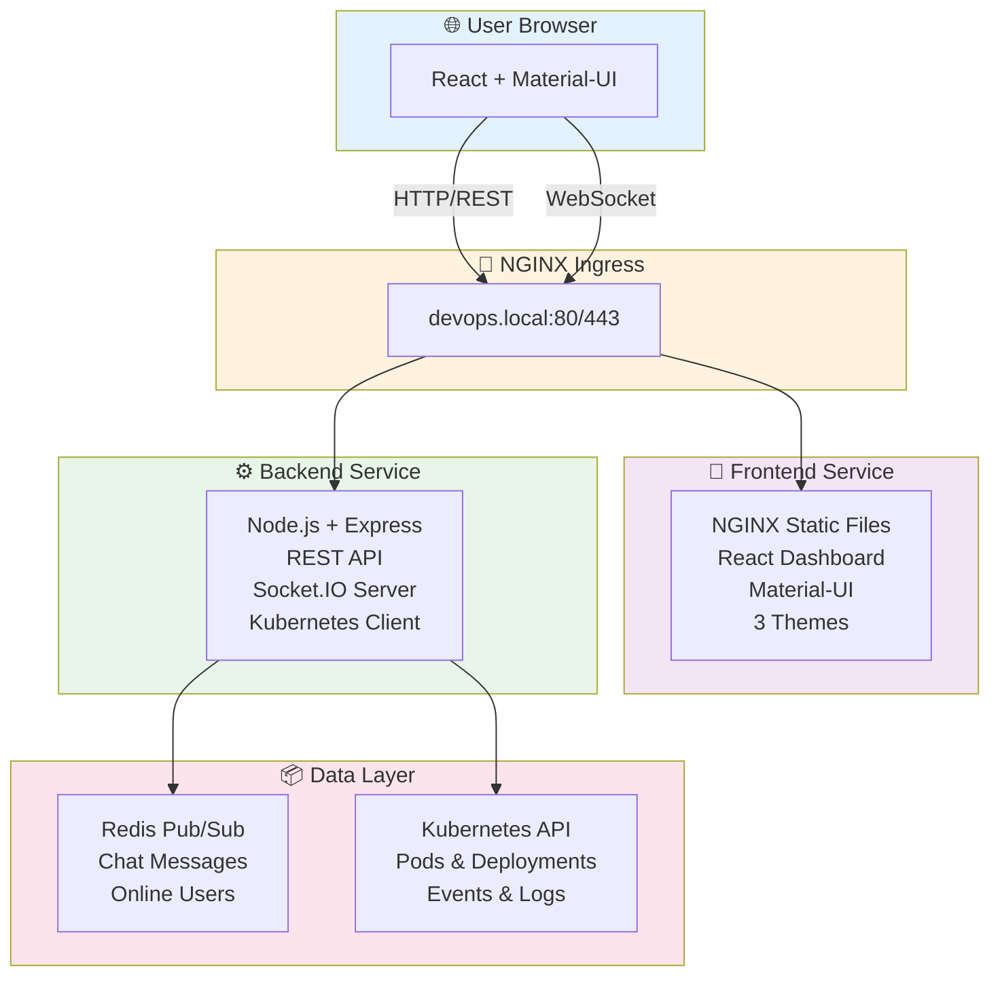
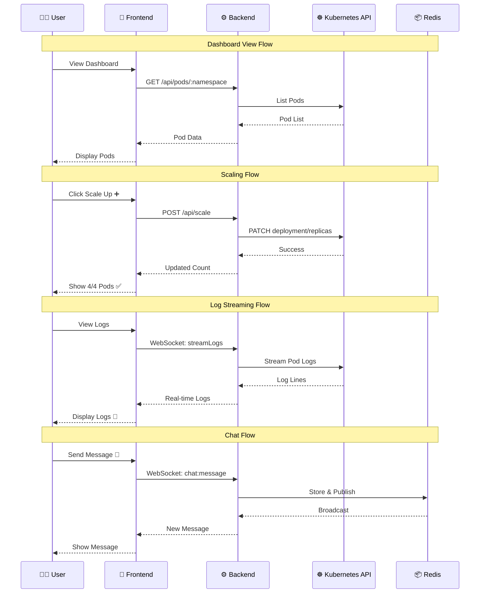
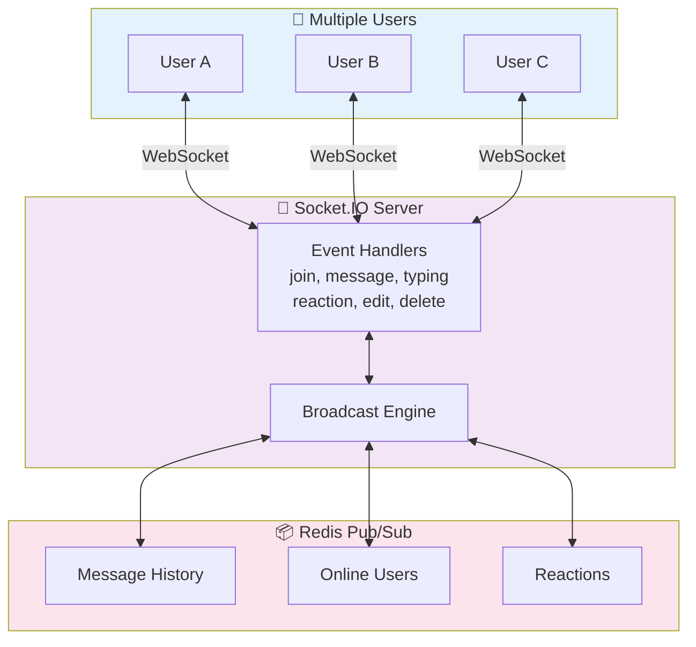
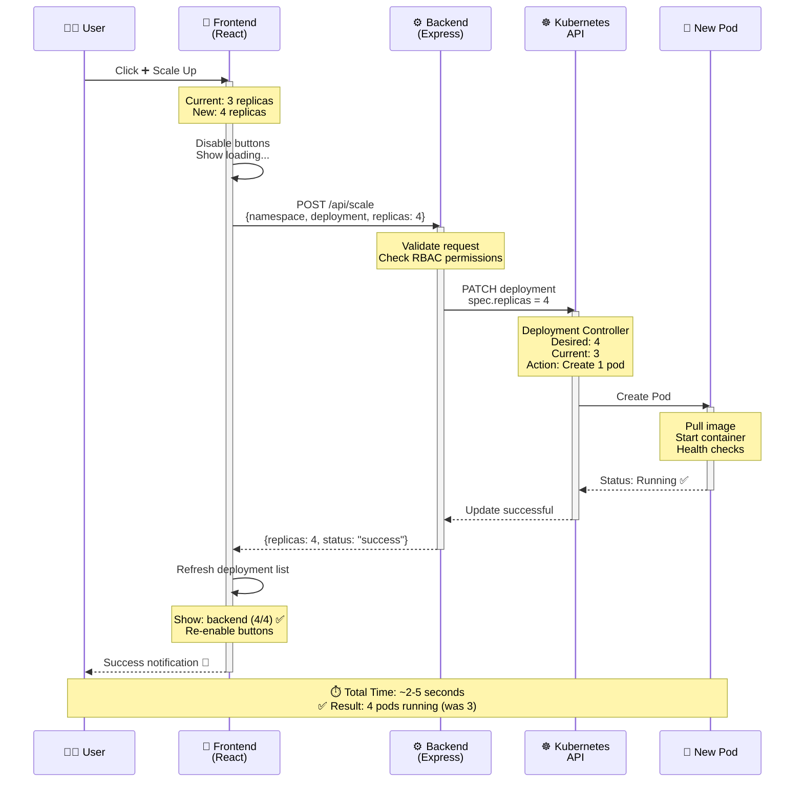

# 🚀 KubePulse - Real-Time Kubernetes Dashboard

<div align="center">


**Modern Kubernetes management dashboard with real-time monitoring, deployment scaling, log streaming, and team chat.**

</div>

---

## 🎬 Architecture Overview



---

## ✨ Features

### 🎛️ **Kubernetes Management**
- 📊 **Real-time Dashboard** - Live cluster monitoring with auto-refresh
- 🚀 **Deployment Scaling** - One-click scale up/down with live updates
- 📦 **Pod Management** - View, restart, and delete pods
- 📈 **Event Monitoring** - Live Kubernetes events stream
- 📜 **Log Streaming** - Real-time pod logs via WebSocket
- 🔄 **Multi-Namespace** - Switch between namespaces instantly

### 💬 **Team Chat** (NEW!)
- 💬 Real-time messaging with Socket.IO
- 👥 Online users with presence indicators
- ⌨️ Live typing indicators
- 😊 8 emoji reactions (👍 ❤️ 😂 😮 😢 😡 🎉 🚀)
- 💬 Reply to messages
- ✏️ Edit & delete messages
- 🔍 Message search
- 📎 File attachments
- ⌨️ Keyboard shortcuts (Ctrl+Enter to send)
- 🎨 Beautiful gradient message bubbles

### 🎨 **UI/UX**
- 🌈 **3 Themes**: Light ☀️, Dark 🌙, Cyberpunk 🌈
- 📱 **Responsive Design** - Desktop 💻, tablet 📱, mobile 📲
- ✨ **Smooth Animations** - Modern Material-UI components 🎭
- 🎯 **Intuitive Interface** - Zero learning curve 🚀

---

## 📊 Data Flow Diagram



---

## 🛠️ Technology Stack

| Layer | Technologies |
|-------|-------------|
| **Frontend** | React 18, Material-UI, Socket.IO Client, Axios |
| **Backend** | Node.js, Express, Socket.IO, Kubernetes Client |
| **Infrastructure** | Kubernetes, Docker, Redis, NGINX |
| **Deployment** | Kind, Docker Compose, Kubernetes YAML |

---

## 📋 Prerequisites

- 🐳 **Docker** (20.10+)
- ☸️ **kubectl** (1.24+)
- 🎯 **Kind** (0.20+) - Optional, script will guide installation
- 💻 **Node.js** (20+) - Only for local development

---

## 🚀 Deployment Flow

```mermaid
graph LR
    A[🎬 Start<br/>./deploy.sh] --> B[🔍 Check<br/>Prerequisites]
    B --> C[🏗️ Create Kind<br/>Cluster<br/>~30s]
    C --> D[🐳 Build Docker<br/>Images<br/>~2min]
    D --> E[📦 Load Images<br/>into Kind<br/>~30s]
    E --> F[🔌 Install NGINX<br/>Ingress<br/>~1min]
    F --> G[☸️ Deploy K8s<br/>Resources<br/>~1min]
    G --> H[⏳ Wait for<br/>Rollout<br/>~30s]
    H --> I[✅ Complete!<br/>http://devops.local<br/>Total: 5-10min]
    
    style A fill:#e3f2fd
    style B fill:#fff3e0
    style C fill:#f3e5f5
    style D fill:#e8f5e9
    style E fill:#fce4ec
    style F fill:#e0f2f1
    style G fill:#fff9c4
    style H fill:#f8bbd0
    style I fill:#c8e6c9
```



**Steps Breakdown:**
1. 🎬 **Start** - Run deployment script
2. 🔍 **Prerequisites** - Check Docker, kubectl, Kind
3. 🏗️ **Create Cluster** - Kind cluster with ingress labels (⏱️ ~30s)
4. 🐳 **Build Images** - Backend & Frontend containers (⏱️ ~2min)
5. 📦 **Load Images** - Push to Kind cluster (⏱️ ~30s)
6. 🔌 **Install Ingress** - NGINX controller setup (⏱️ ~1min)
7. ☸️ **Deploy Resources** - All K8s manifests (⏱️ ~1min)
8. ⏳ **Wait Rollout** - Pods become Ready (⏱️ ~30s)
9. ✅ **Complete** - Application ready at http://devops.local

---

## 🚀 Quick Start

### **One-Command Deployment** 🎯

```bash
# Clone the repository
git clone https://github.com/Sandarsh18/KubePulse-Real-Time-Kubernetes-Management-Dashboard.git
cd cl-mg

# Deploy everything with one command
./deploy.sh
```

**That's it!** 🎉 The script will:
1. ✅ Create Kind cluster (if needed) 🏗️
2. ✅ Build Docker images 🐳
3. ✅ Install NGINX Ingress 🔌
4. ✅ Deploy all resources ☸️
5. ✅ Configure networking 🌐

**Access the application:**
```
🌐 http://devops.local
```

> 💡 **First-time setup takes 5-10 minutes** (downloads ~2GB of images) ⏱️

---

## 💬 Chat System Architecture



**Features:**
- 💬 Real-time messaging
- ⌨️ Live typing indicators
- 👥 Online user presence
- 😊 8 emoji reactions (👍 ❤️ 😂 😮 😢 😡 🎉 🚀)
- 💬 Reply to messages
- ✏️ Edit messages
- 🗑️ Delete messages
- 🔍 Search functionality
- 📎 File attachments
- ⌨️ Keyboard shortcuts (Ctrl+Enter)

---

## 📁 Project Structure

```
cl-mg/
├── 📄 README.md                    # Streamlined documentation (370 lines)
├── 📄 CHAT_EXPLAINED.md            # 💬 Chat features guide
├── 📄 LICENSE                      # ⚖️ MIT License
├── 🧹 cleanup.sh                   # 🗑️ Unified cleanup script
├── 🚀 deploy.sh                    # 🎯 One-command deployment
├── 🐳 docker-compose.yml           # 🔧 Docker Compose config
├── 📝 .gitignore                   # 🚫 Updated ignore rules
│
├── frontend/                       # 🎨 React application
│   ├── src/
│   │   ├── components/            # ⚛️ React components
│   │   ├── pages/                 # 📄 Dashboard, Logs, Chat
│   │   │   ├── Dashboard.jsx     # 📊 Main dashboard
│   │   │   ├── Logs.jsx          # 📜 Log streaming
│   │   │   └── Chat.jsx          # 💬 Team chat
│   │   └── App.jsx                # 🎯 Main app with routing
│   ├── Dockerfile                 # 🐳 Frontend container
│   └── package.json               # 📦 Dependencies
│
├── backend/                        # ⚙️ Node.js backend API
│   ├── src/
│   │   ├── server.js              # 🚀 Express + Socket.IO server
│   │   ├── api/
│   │   │   ├── k8sRoutes.js      # ☸️ Kubernetes REST API
│   │   │   └── chatRoutes.js     # 💬 Chat API
│   │   ├── sockets/
│   │   │   ├── logs.js           # 📜 Log streaming socket
│   │   │   └── chat.js           # 💬 Chat socket handlers
│   │   └── utils/
│   │       ├── k8sClient.js      # ☸️ K8s client wrapper
│   │       └── redis.js          # 📦 Redis connection
│   ├── Dockerfile                 # 🐳 Backend container
│   └── package.json               # 📦 Dependencies
│
├── k8s/                            # ☸️ Kubernetes manifests
│   ├── namespace.yaml             # 📦 devops-demo namespace
│   ├── rbac.yaml                  # 🔐 ServiceAccount & permissions
│   ├── backend-deployment.yaml    # ⚙️ Backend deployment
│   ├── frontend-deployment.yaml   # 🎨 Frontend deployment
│   ├── redis-deployment.yaml      # 📦 Redis deployment
│   ├── service.yaml               # 🔌 Services
│   └── ingress.yaml               # 🌐 NGINX Ingress
│
├── deploy.sh                       # 🚀 One-click deployment script
├── cleanup.sh                      # 🧹 Complete cleanup script
└── README.md                       # 📚 This file
```

---

## ⚙️ Configuration

### **Environment Variables** 🔧

**Backend** (`backend/.env`):
```bash
PORT=5000                    # 🔌 API port
REDIS_HOST=redis             # 📦 Redis hostname
REDIS_PORT=6379              # 🔌 Redis port
NODE_ENV=production          # 🚀 Environment
```

**Frontend** (build-time):
```bash
REACT_APP_API_URL=http://devops.local/api    # 🌐 API endpoint
REACT_APP_WS_URL=http://devops.local         # 🔌 WebSocket URL
```

### **Kubernetes Configuration** ☸️

The application uses Kubernetes ServiceAccount with RBAC permissions:
- ✅ Read pods, deployments, events 📊
- ✅ Update deployments (scaling) 🚀
- ✅ Delete pods (restart functionality) 🔄
- ✅ Stream pod logs 📜

See `k8s/rbac.yaml` for detailed permissions. 🔐

---

## 🎨 Usage Guide

### **Dashboard Tab** 📊
1. 📂 Select namespace from dropdown
2. 👀 View pods and deployments
3. ➕➖ Scale deployments with buttons
4. 🖱️ Click pods for quick actions (logs, restart, delete)

### **Logs Tab** 📜
1. 📂 Select namespace and pod
2. 🎯 Choose container (if multiple)
3. 👁️ View real-time streaming logs
4. 🔽 Auto-scroll follows new logs

### **Chat Tab** 💬
1. ✍️ Enter username to join
2. 📤 Send messages (Ctrl+Enter ⌨️)
3. 😊 React to messages with emojis
4. 💬 Reply, edit ✏️, or delete 🗑️ your messages
5. 🔍 Search messages with icon

### **Theme Switcher** 🎨
Click the theme button (top-right) to cycle through:
- ☀️ Light Theme (Clean & Professional)
- 🌙 Dark Theme (Easy on Eyes)
- 🌈 Cyberpunk Theme (Futuristic Neon)

---

## 🔄 Scaling Operations Flow



---

## 📡 API Endpoints

### **REST API** 🔌

```bash
GET  /api/namespaces              # 📂 List all namespaces
GET  /api/pods/:namespace         # 📦 List pods in namespace
GET  /api/deployments/:namespace  # 🚀 List deployments
GET  /api/events/:namespace       # 📈 List recent events
POST /api/scale                   # ⚖️ Scale deployment
     Body: { namespace, deployment, replicas }
DELETE /api/pods/:namespace/:pod  # 🗑️ Delete pod
```

### **WebSocket Events** 🔌

```javascript
// Client → Server 📤
socket.emit('streamLogs', { namespace, pod, container })      // 📜
socket.emit('chat:message', { username, message })            // 💬
socket.emit('chat:typing', { username, isTyping })            // ⌨️
socket.emit('chat:reaction', { messageId, emoji })            // 😊

// Server → Client 📥
socket.on('logs', (data) => { /* log line */ })               // 📜
socket.on('chat:message', (message) => { /* new message */ }) // 💬
socket.on('chat:userJoined', (user) => { /* user joined */ }) // 👋
socket.on('chat:typing', (data) => { /* typing indicator */ })// ⌨️
```

---

## 🐛 Troubleshooting

### **"Cannot connect to cluster"** ⚠️
```bash
# Check Kind cluster is running
kind get clusters

# Check kubectl context
kubectl config current-context

# Should show: kind-devops ✅
```

### **"Images not loading"** 🐳
```bash
# Check images are loaded into Kind
docker exec -it devops-control-plane crictl images

# Rebuild and reload 🔄
./cleanup.sh    # Type YES
./deploy.sh     # Rebuild everything
```

### **"Ingress not working"** 🌐
```bash
# Check ingress controller
kubectl -n ingress-nginx get pods

# Check /etc/hosts has entry 📝
grep devops.local /etc/hosts
# Should show: 127.0.0.1 devops.local ✅

# Add if missing ➕
echo "127.0.0.1 devops.local" | sudo tee -a /etc/hosts
```

### **"Chat not working"** 💬
```bash
# Check Redis is running 📦
kubectl -n devops-demo get pods | grep redis

# Check WebSocket connection in browser console 🔍
# Should show: WebSocket connected to http://devops.local ✅
```

---

## 🧹 Cleanup

### **Complete Cleanup** 🗑️
```bash
./cleanup.sh
# Type: YES

# This removes: 🧨
# • All Docker images 🐳
# • All containers 📦
# • Kind cluster ☸️
# • Docker cache 💾
```

### **Partial Cleanup** 🔧
```bash
# Just delete the cluster ☸️
kind delete cluster --name devops

# Remove only project images 🐳
docker rmi backend:latest frontend:latest
```

---

## 🚀 Advanced Deployment

### **Docker Compose** (Alternative) 🐳
```bash
# For local development without Kubernetes
docker-compose up -d
```

### **Production Kubernetes** ☸️
```bash
# Apply to any Kubernetes cluster
kubectl apply -f k8s/

# Update image registry 🔄
# Edit k8s/*-deployment.yaml
# Change: image: backend:latest
# To: image: your-registry/backend:v1.0.0
```

### **Custom Configuration** ⚙️
```bash
# Edit namespace 📂
sed -i 's/devops-demo/your-namespace/g' k8s/*.yaml

# Edit ingress domain 🌐
sed -i 's/devops.local/your-domain.com/g' k8s/ingress.yaml
```

---

## 📊 Performance

- ⚡ **Sub-second log streaming** via WebSocket 🚀
- 🔄 **5-second event refresh** cycle ⏱️
- 💬 **Real-time chat** with Redis pub/sub 📦
- 📉 **Minimal CPU/Memory** usage (< 500MB total) 💻
- 🚀 **Fast scaling** operations (< 2 seconds) ⚡

---

## 🔒 Security

- 🛡️ **RBAC enabled** with least-privilege ServiceAccount 🔐
- 🔐 **No cluster-admin** permissions required ✅
- 📝 **Audit logging** for all operations 📊
- 🚫 **No sensitive data** stored in frontend 🔒
- ✅ **CORS configured** for API security 🌐

---

## 🤝 Contributing

Contributions are welcome! Please:

1. 🍴 Fork the repository
2. 🌿 Create a feature branch (`git checkout -b feature/amazing-feature`)
3. 💾 Commit your changes (`git commit -m 'Add amazing feature'`)
4. 📤 Push to the branch (`git push origin feature/amazing-feature`)
5. 🔀 Open a Pull Request

---

## 📄 License

This project is licensed under the MIT License. ⚖️

---

## 👨‍💻 Author

**Sandarsh J N** 🚀

- 🐙 GitHub: [@Sandarsh18](https://github.com/Sandarsh18)
- 📦 Project: [KubePulse Dashboard](https://github.com/Sandarsh18/KubePulse-Real-Time-Kubernetes-Management-Dashboard)

---

## 📚 Additional Documentation

- 💬 **Chat Features**: See `CHAT_EXPLAINED.md` for detailed chat documentation 📖
- 🏗️ **Architecture**: Check inline code comments for technical details 💡
- 🐛 **Issues**: Report bugs on [GitHub Issues](https://github.com/Sandarsh18/KubePulse-Real-Time-Kubernetes-Management-Dashboard/issues) 🔧

---

<div align="center">

### ⭐ Star this project if you find it helpful! ⭐

**Made with ❤️ for the DevOps community** 🚀

```
     ___           ___           ___           ___     
    /\__\         /\  \         /\  \         /\  \    
   /:/  /        /::\  \       /::\  \       /::\  \   
  /:/__/        /:/\:\  \     /:/\:\  \     /:/\:\  \  
 /::\  \ ___   /::\~\:\  \   /::\~\:\  \   /::\~\:\  \ 
/:/\:\  /\__\ /:/\:\ \:\__\ /:/\:\ \:\__\ /:/\:\ \:\__\
\/__\:\/:/  / \/__\:\/:/  / \:\~\:\ \/__/ \:\~\:\ \/__/
     \::/  /       \::/  /   \:\ \:\__\    \:\ \:\__\  
     /:/  /        /:/  /     \:\ \/__/     \:\ \/__/  
    /:/  /        /:/  /       \:\__\        \:\__\    
    \/__/         \/__/         \/__/         \/__/    

                    KubePulse Dashboard
            Real-Time Kubernetes Management 🚀
```

### 🎯 Quick Links

[📖 Documentation](README.md) • [💬 Chat Guide](CHAT_EXPLAINED.md) • [🐛 Issues](https://github.com/Sandarsh18/KubePulse-Real-Time-Kubernetes-Management-Dashboard/issues) • [⭐ Star](https://github.com/Sandarsh18/KubePulse-Real-Time-Kubernetes-Management-Dashboard)

</div>
