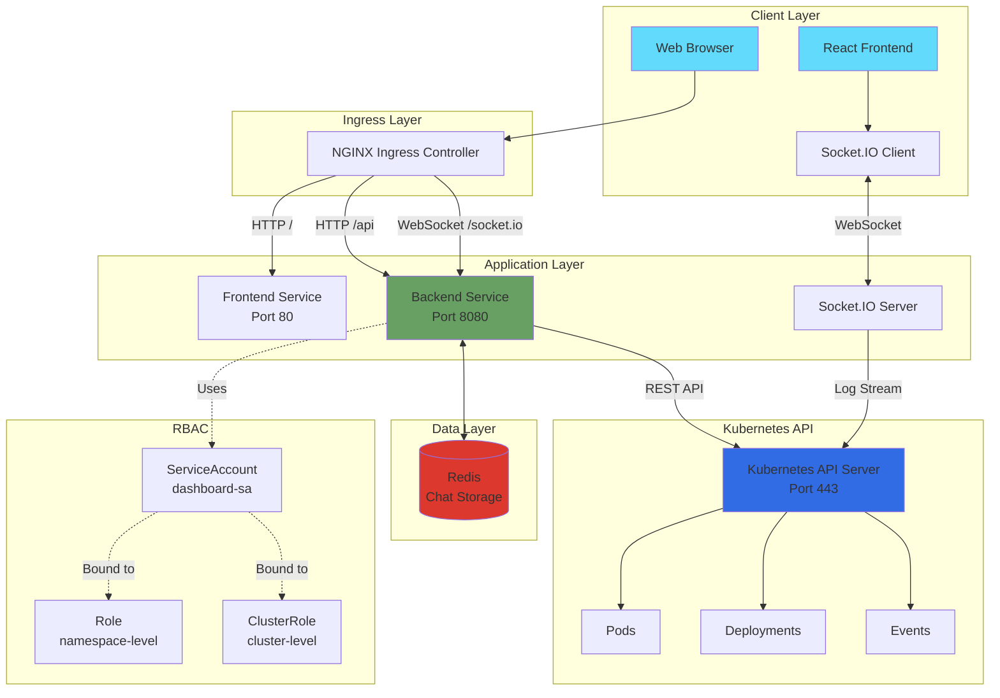
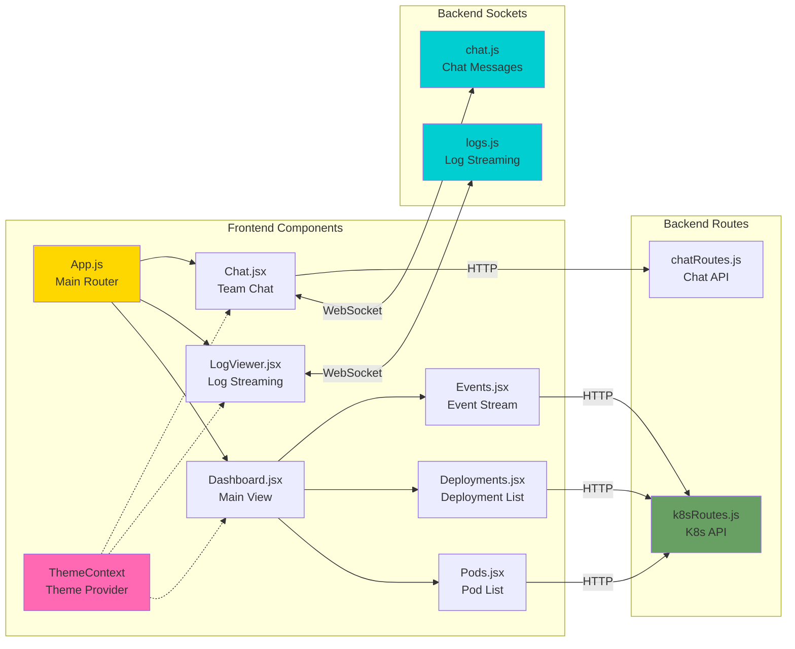
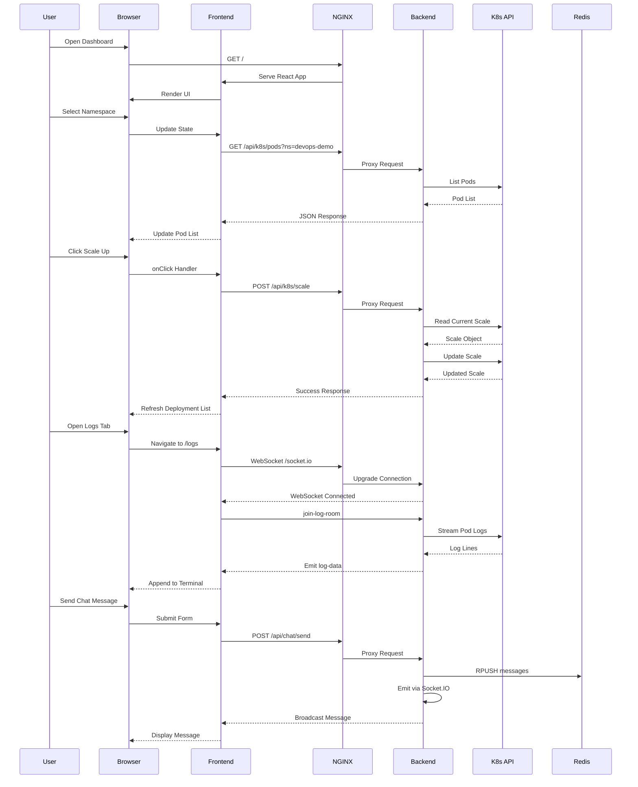
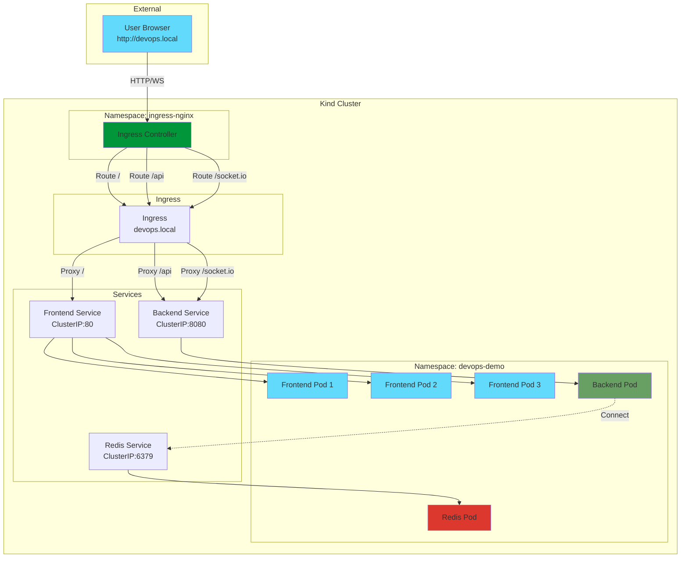
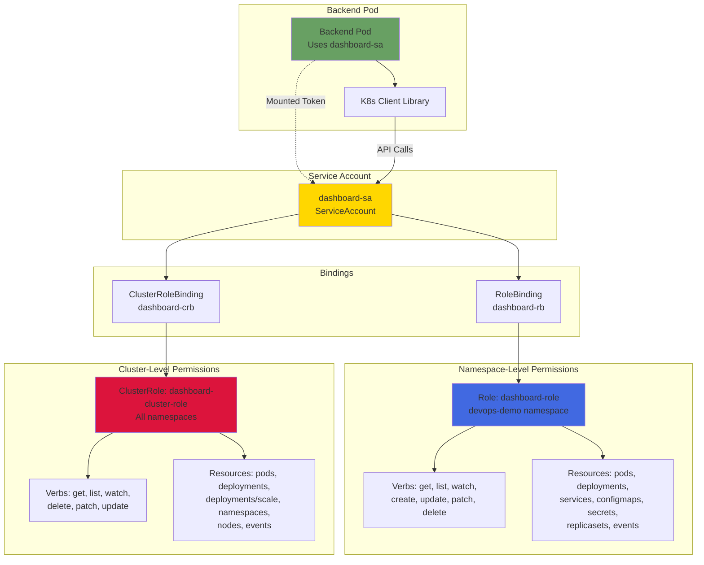

# 🚀 Real-Time Kubernetes Cluster Management Dashboard

<div align="center">


**A modern, full-stack production-ready application for managing Kubernetes clusters with real-time monitoring, deployment scaling, pod management, live log streaming, and integrated team chat.**

[Features](#-features) • [Architecture](#-architecture) • [Quick Start](#-quick-start) • [Documentation](#-documentation) • [API Reference](#-api-reference)

</div>

---

## 📑 Table of Contents

- [Overview](#-overview)
- [Features](#-features)
- [Architecture](#-architecture)
- [Technology Stack](#-technology-stack)
- [Prerequisites](#-prerequisites)
- [Installation](#-installation)
- [Quick Start](#-quick-start)
- [Project Structure](#-project-structure)
- [Configuration](#-configuration)
- [API Reference](#-api-reference)
- [WebSocket Events](#-websocket-events)
- [RBAC Configuration](#-rbac-configuration)
- [Theme System](#-theme-system)
- [Deployment](#-deployment)
- [Troubleshooting](#-troubleshooting)
- [Performance](#-performance)
- [Security](#-security)
- [Contributing](#-contributing)
- [License](#-license)

---

## 🎯 Overview

The **Kubernetes Dashboard** is a comprehensive web-based management interface that provides DevOps teams with powerful tools to monitor, manage, and interact with Kubernetes clusters in real-time. Built with modern technologies and best practices, it offers an intuitive UI with live data streaming, deployment scaling, pod management, and team collaboration features.

### Why This Dashboard?

- **🎨 Beautiful UI/UX**: Modern design with 3 theme options (Light, Dark, Cyberpunk)
- **⚡ Real-Time Updates**: WebSocket-based live streaming for logs and chat
- **🔒 Secure RBAC**: Fine-grained Kubernetes permissions with ServiceAccount
- **📱 Responsive Design**: Works seamlessly on desktop, tablet, and mobile
- **🚀 Production Ready**: Battle-tested with proper error handling and logging
- **🔧 Easy Deployment**: One-command deployment script for Kind clusters
- **📊 Comprehensive Monitoring**: Pods, Deployments, Events, and Logs in one place

---

## ✨ Features

### 🎛️ Kubernetes Cluster Management

#### **Dashboard View**
- **Namespace Overview**: Real-time namespace selection and switching
- **Pod Monitoring**: View all pods with status indicators (Running, Pending, Failed, CrashLoopBackOff)
- **Deployment Management**: Live deployment status with replica counts
- **Cluster Statistics**: Running pods, total deployments, and namespace count
- **Health Indicators**: Color-coded status badges with pulse animations
- **Quick Actions Sidebar**: 
  - View Pod Logs (redirects to Logs tab)
  - Team Chat (opens chat interface)
  - Restart Pod (with confirmation dialog)
  - Delete Pod (with confirmation dialog)

#### **Deployment Scaling**
- **One-Click Scaling**: Increment (➕) or decrement (➖) replica counts
- **Live Updates**: Deployment list refreshes automatically after scaling
- **Visual Feedback**: Loading indicators during scaling operations
- **Error Handling**: User-friendly error messages with detailed responses
- **Smart Scaling**: 
  - Scale up: Adds one replica
  - Scale down: Removes one replica (minimum 0)
  - Disabled buttons when scaling in progress

#### **Pod Management**
- **Pod Details Panel**: Click any pod to view:
  - Pod name and namespace
  - Current status and phase
  - Container information
  - Resource requests/limits
  - Node placement
  - Creation timestamp
- **Restart Functionality**: Force restart pods by deleting them (Kubernetes auto-recreates)
- **Delete Capability**: Remove pods with confirmation dialogs
- **Quick Navigation**: Direct links to pod logs from dashboard

#### **Event Monitoring**
- **Real-Time Events**: Live Kubernetes event stream
- **Event Types**: Normal, Warning, Error events with color coding
- **Event Details**:
  - Event reason (Killing, Scheduling, ScalingReplicaSet, etc.)
  - Involved object (Pod, Deployment, ReplicaSet)
  - Event message and timestamps
  - Age calculation (e.g., "3m ago")
- **Auto-Refresh**: Events update every 5 seconds
- **Scrollable History**: Recent 50 events displayed

### 📜 Real-Time Log Streaming

- **Live WebSocket Streaming**: Continuous log streaming using Socket.IO
- **Namespace & Pod Selection**: Dropdown filters for easy navigation
- **Container Selection**: Choose specific containers in multi-container pods
- **Smart Auto-Scroll**: 
  - Automatically scrolls when user is at bottom
  - Stops auto-scroll when user scrolls up to read
  - Resumes when user scrolls back to bottom
- **Terminal-Style Display**: Monospace font with cyberpunk aesthetics
- **Connection Status**: Visual indicators for WebSocket connection state
- **Log Persistence**: Maintains log history during session
- **Error Handling**: Graceful handling of disconnections and pod failures

### 💬 Integrated Team Chat

- **Real-Time Messaging**: Instant message delivery via WebSockets
- **Persistent Chat History**: Messages stored in Redis with 24-hour retention
- **User Identification**: 
  - Customizable usernames
  - Color-coded user badges
  - Anonymous user support
- **Message Features**:
  - Timestamps on all messages
  - Message grouping by user
  - Support for multi-line messages
  - Character limit: 500 characters
- **Chat UI**:
  - Auto-scrolling chat window
  - Message bubbles with gradient backgrounds
  - User indicators (You vs Other users)
  - Typing indicators
  - Online user count

### 🎨 Theme System

Three beautiful themes with seamless switching:

#### **Light Theme** 
- Clean white backgrounds
- Blue gradients for accents
- High contrast for readability
- Perfect for daytime use

#### **Dark Theme**
- Dark gray backgrounds
- Purple/blue gradients
- Reduced eye strain
- Ideal for night work

#### **Cyberpunk Theme** 🌟
- Matrix-inspired dark backgrounds
- Neon cyan/magenta gradients
- Futuristic aesthetic
- Animated glow effects

**Theme Features**:
- Persistent theme selection (localStorage)
- Smooth transitions between themes
- Consistent styling across all components
- Theme toggle in navigation bar

### 🔔 Additional Features

- **Responsive Navigation**: Tab-based routing with active indicators
- **Loading States**: Skeleton loaders and spinners
- **Error Boundaries**: Graceful error handling with user-friendly messages
- **Tooltips**: Helpful hints on hover
- **Animations**: Smooth transitions, pulse effects, and hover animations
- **Accessibility**: Keyboard navigation and screen reader support
- **Mobile Responsive**: Fully functional on all device sizes

---

## 🏗️ Architecture

### System Architecture Diagram



### Component Architecture



### Data Flow Diagram



### Deployment Architecture



### RBAC Permission Flow



---

## 🛠️ Technology Stack

### Frontend

| Technology | Version | Purpose |
|------------|---------|---------|
| **React** | 18.3.1 | UI library for building interactive interfaces |
| **Vite** | 5.4.20 | Fast build tool and dev server |
| **React Router** | 6.28.0 | Client-side routing and navigation |
| **Axios** | 1.7.9 | HTTP client for API requests |
| **Socket.IO Client** | 4.8.1 | WebSocket client for real-time communication |
| **TailwindCSS** | 3.4.17 | Utility-first CSS framework |
| **PostCSS** | 8.4.49 | CSS transformations |
| **ESLint** | 9.17.0 | Code linting and quality |

### Backend

| Technology | Version | Purpose |
|------------|---------|---------|
| **Node.js** | 20-alpine | JavaScript runtime |
| **Express** | 4.21.2 | Web application framework |
| **Socket.IO** | 4.8.1 | WebSocket server for real-time features |
| **@kubernetes/client-node** | 0.22.1 | Official Kubernetes client library |
| **ioredis** | 5.4.2 | Redis client for chat persistence |
| **cors** | 2.8.5 | Cross-Origin Resource Sharing middleware |
| **morgan** | 1.10.0 | HTTP request logger |
| **dotenv** | 16.4.7 | Environment variable management |
| **prom-client** | 15.1.3 | Prometheus metrics exporter |

### Infrastructure

| Component | Version | Purpose |
|-----------|---------|---------|
| **Kubernetes** | 1.27+ | Container orchestration platform |
| **Kind** | 0.20+ | Local Kubernetes cluster |
| **Docker** | 20.10+ | Container runtime |
| **NGINX Ingress** | 1.11.1 | Ingress controller for routing |
| **Redis** | 7-alpine | In-memory data store for chat |

### DevOps Tools

- **Docker Compose** - Local development environment
- **kubectl** - Kubernetes CLI tool
- **kind** - Kubernetes in Docker
- **bash** - Deployment automation scripts

---

## 📋 Prerequisites

### System Requirements

- **Operating System**: Linux, macOS, or Windows (with WSL2)
- **CPU**: 2+ cores recommended
- **RAM**: 4GB minimum, 8GB recommended
- **Disk Space**: 10GB free space

### Required Software

1. **Docker** (20.10 or higher)
   ```bash
   docker --version
   # Docker version 20.10.0 or higher
   ```

2. **kubectl** (1.27 or higher)
   ```bash
   kubectl version --client
   # Client Version: v1.27.0 or higher
   ```

3. **Kind** (0.20 or higher)
   ```bash
   kind version
   # kind v0.20.0 or higher
   ```

4. **Git**
   ```bash
   git --version
   # git version 2.30.0 or higher
   ```

### Optional Tools

- **Node.js** 20+ (for local development without Docker)
- **npm** or **yarn** (for dependency management)
- **Postman** or **curl** (for API testing)

---

## 🚀 Installation

### 1. Clone the Repository

```bash
git clone https://github.com/yourusername/k8s-dashboard.git
cd k8s-dashboard
```

### 2. Project Structure

```
k8s-dashboard/
├── frontend/                  # React frontend application
│   ├── src/
│   │   ├── components/       # Reusable React components
│   │   │   ├── Deployments.jsx
│   │   │   ├── Events.jsx
│   │   │   ├── LogViewer.jsx
│   │   │   └── Pods.jsx
│   │   ├── pages/           # Page components
│   │   │   ├── Chat.jsx
│   │   │   ├── Dashboard.jsx
│   │   │   └── Logs.jsx
│   │   ├── context/         # React Context providers
│   │   │   └── ThemeContext.jsx
│   │   ├── App.jsx          # Main application component
│   │   └── main.jsx         # Application entry point
│   ├── nginx-cluster.conf   # NGINX configuration for Kubernetes
│   ├── Dockerfile           # Multi-stage Docker build
│   ├── package.json         # Frontend dependencies
│   └── vite.config.js       # Vite configuration
│
├── backend/                  # Node.js backend application
│   ├── src/
│   │   ├── api/            # REST API routes
│   │   │   ├── k8sRoutes.js    # Kubernetes operations
│   │   │   └── chatRoutes.js   # Chat endpoints
│   │   ├── sockets/        # WebSocket handlers
│   │   │   ├── chat.js         # Chat socket events
│   │   │   └── logs.js         # Log streaming
│   │   ├── utils/          # Utility functions
│   │   │   └── k8sClient.js    # K8s client initialization
│   │   └── server.js       # Express server entry point
│   ├── Dockerfile          # Backend Docker image
│   └── package.json        # Backend dependencies
│
├── k8s/                     # Kubernetes manifests
│   ├── backend.yaml        # Backend deployment and service
│   ├── frontend.yaml       # Frontend deployment and service
│   ├── redis.yaml          # Redis deployment and service
│   ├── rbac.yaml           # RBAC permissions
│   └── ingress.yaml        # Ingress configuration
│
├── docker-compose.yaml     # Local development setup
├── deploy.sh              # Automated deployment script
├── README.md              # This file
└── .gitignore            # Git ignore patterns
```

---

## 🎯 Quick Start

### Option 1: Deploy to Kind Cluster (Recommended)

This method deploys the full application to a local Kubernetes cluster using Kind.

```bash
# Make the script executable
chmod +x deploy.sh

# Run the deployment
./deploy.sh
```

The script will:
1. ✅ Check for required tools (docker, kubectl, kind)
2. ✅ Create a Kind cluster named `devops` (if not exists)
3. ✅ Install NGINX Ingress Controller
4. ✅ Build Docker images for frontend and backend
5. ✅ Load images into Kind cluster
6. ✅ Create `devops-demo` namespace
7. ✅ Apply RBAC permissions
8. ✅ Deploy Redis, Backend, and Frontend
9. ✅ Configure Ingress for `devops.local`
10. ✅ Add `devops.local` to `/etc/hosts` (requires sudo)
11. ✅ Wait for all pods to be ready
12. ✅ Display access information

**Access the application:**
- Open your browser and go to **http://devops.local**

### Option 2: Local Development with Docker Compose

For rapid development without Kubernetes:

```bash
# Start all services
docker compose up -d --build

# View logs
docker compose logs -f

# Stop services
docker compose down
```

**Access the application:**
- Frontend: **http://localhost:5173**
- Backend API: **http://localhost:8080**
- Health Check: **http://localhost:8080/api/health**

### Option 3: Manual Deployment

If you prefer manual control:

```bash
# 1. Create Kind cluster
kind create cluster --name devops

# 2. Install NGINX Ingress
kubectl apply -f https://raw.githubusercontent.com/kubernetes/ingress-nginx/main/deploy/static/provider/kind/deploy.yaml

# 3. Wait for ingress to be ready
kubectl wait --namespace ingress-nginx \
  --for=condition=ready pod \
  --selector=app.kubernetes.io/component=controller \
  --timeout=120s

# 4. Build and load images
docker build -t frontend:latest ./frontend
docker build -t backend:latest ./backend
kind load docker-image frontend:latest --name devops
kind load docker-image backend:latest --name devops

# 5. Create namespace
kubectl create namespace devops-demo

# 6. Apply Kubernetes manifests
kubectl apply -f k8s/rbac.yaml
kubectl apply -f k8s/redis.yaml
kubectl apply -f k8s/backend.yaml
kubectl apply -f k8s/frontend.yaml
kubectl apply -f k8s/ingress.yaml

# 7. Add to /etc/hosts
echo "127.0.0.1 devops.local" | sudo tee -a /etc/hosts

# 8. Wait for pods
kubectl -n devops-demo wait --for=condition=ready pod --all --timeout=300s

# 9. Access application
# Open http://devops.local in browser
```

---

## ⚙️ Configuration

### Environment Variables

#### Backend Configuration

Create a `.env` file in the `backend/` directory:

```env
# Server Configuration
PORT=8080
NODE_ENV=production

# Redis Configuration
REDIS_HOST=redis
REDIS_PORT=6379
REDIS_PASSWORD=

# Kubernetes Configuration
DEMO_MODE=false
KUBECONFIG=/etc/kubeconfig

# Logging
LOG_LEVEL=info
```

#### Frontend Configuration

Frontend uses Vite environment variables. Create `.env` in `frontend/`:

```env
# API Configuration
VITE_API_URL=/api
VITE_SOCKET_URL=/
VITE_SOCKET_PATH=/socket.io
```

### Kubernetes ConfigMap

For dynamic configuration in Kubernetes:

```yaml
apiVersion: v1
kind: ConfigMap
metadata:
  name: dashboard-config
  namespace: devops-demo
data:
  REDIS_HOST: "redis"
  REDIS_PORT: "6379"
  LOG_LEVEL: "info"
```

### NGINX Configuration

The frontend uses a custom NGINX configuration (`frontend/nginx-cluster.conf`):

```nginx
server {
  listen 80;
  server_name _;
  root /usr/share/nginx/html;
  index index.html;

  # Proxy API requests to backend
  location /api {
    proxy_pass http://backend:8080;
    proxy_http_version 1.1;
    proxy_set_header Upgrade $http_upgrade;
    proxy_set_header Connection "upgrade";
    proxy_set_header Host $host;
    proxy_set_header X-Real-IP $remote_addr;
    proxy_set_header X-Forwarded-For $proxy_add_x_forwarded_for;
    proxy_set_header X-Forwarded-Proto $scheme;
  }

  # Proxy WebSocket connections
  location /socket.io/ {
    proxy_pass http://backend:8080/socket.io/;
    proxy_http_version 1.1;
    proxy_set_header Upgrade $http_upgrade;
    proxy_set_header Connection "upgrade";
    proxy_set_header Host $host;
    proxy_cache_bypass $http_upgrade;
  }

  # Serve React app
  location / {
    try_files $uri /index.html;
  }
}
```

---

## 📡 API Reference

### REST API Endpoints

#### Health Check

```http
GET /api/health
```

**Response:**
```json
{
  "status": "ok"
}
```

#### Namespaces

```http
GET /api/k8s/namespaces
```

**Response:**
```json
["default", "kube-system", "devops-demo"]
```

#### Pods

```http
GET /api/k8s/pods?ns=devops-demo
```

**Query Parameters:**
- `ns` (string, optional): Namespace name (default: "devops-demo")

**Response:**
```json
[
  {
    "metadata": {
      "name": "backend-5ff9b9969f-abc12",
      "namespace": "devops-demo",
      "uid": "...",
      "creationTimestamp": "2025-10-17T07:00:00Z"
    },
    "status": {
      "phase": "Running",
      "conditions": [...],
      "containerStatuses": [...]
    },
    "spec": {
      "containers": [...],
      "nodeName": "devops-control-plane"
    }
  }
]
```

#### Deployments

```http
GET /api/k8s/deployments?ns=devops-demo
```

**Query Parameters:**
- `ns` (string, optional): Namespace name

**Response:**
```json
[
  {
    "metadata": {
      "name": "frontend",
      "namespace": "devops-demo"
    },
    "spec": {
      "replicas": 3
    },
    "status": {
      "replicas": 3,
      "readyReplicas": 3,
      "availableReplicas": 3
    }
  }
]
```

#### Scale Deployment

```http
POST /api/k8s/scale
Content-Type: application/json
```

**Request Body:**
```json
{
  "ns": "devops-demo",
  "name": "frontend",
  "replicas": 5
}
```

**Response:**
```json
{
  "apiVersion": "autoscaling/v1",
  "kind": "Scale",
  "metadata": {
    "name": "frontend",
    "namespace": "devops-demo"
  },
  "spec": {
    "replicas": 5
  },
  "status": {
    "replicas": 3,
    "selector": "app=frontend"
  }
}
```

#### Restart Pod

```http
POST /api/k8s/pods/:name/restart
Content-Type: application/json
```

**Request Body:**
```json
{
  "ns": "devops-demo"
}
```

**Response:**
```json
{
  "status": "restarted"
}
```

#### Delete Pod

```http
DELETE /api/k8s/pods/:name?ns=devops-demo
```

**Response:**
```json
{
  "status": "deleted"
}
```

#### Pod Logs

```http
GET /api/k8s/logs?ns=devops-demo&pod=backend-abc123&container=backend
```

**Query Parameters:**
- `ns` (string, required): Namespace name
- `pod` (string, required): Pod name
- `container` (string, optional): Container name

**Response:**
```text
2025-10-17T07:00:00.000Z Backend listening on 8080
2025-10-17T07:00:01.000Z GET /api/health 200 0.123 ms
```

#### Events

```http
GET /api/k8s/events?ns=devops-demo
```

**Response:**
```json
[
  {
    "metadata": {
      "name": "event-12345"
    },
    "type": "Normal",
    "reason": "ScalingReplicaSet",
    "message": "Scaled up replica set frontend-abc123 to 3",
    "involvedObject": {
      "kind": "Deployment",
      "name": "frontend"
    },
    "firstTimestamp": "2025-10-17T07:00:00Z",
    "lastTimestamp": "2025-10-17T07:00:00Z"
  }
]
```

#### Chat Messages

```http
GET /api/chat/messages
```

**Response:**
```json
[
  {
    "user": "DevOpsUser",
    "message": "Deployment successful!",
    "time": "2025-10-17T07:00:00.000Z"
  }
]
```

#### Send Chat Message

```http
POST /api/chat/send
Content-Type: application/json
```

**Request Body:**
```json
{
  "user": "DevOpsUser",
  "message": "Hello team!"
}
```

**Response:**
```json
{
  "success": true
}
```

---

## 🔌 WebSocket Events

### Log Streaming

**Connect:**
```javascript
const socket = io('/', { path: '/socket.io' })
```

**Join Log Room:**
```javascript
socket.emit('join-log-room', {
  namespace: 'devops-demo',
  pod: 'backend-abc123',
  container: 'backend'
})
```

**Receive Logs:**
```javascript
socket.on('log-data', (data) => {
  console.log(data.line)  // Log line string
})
```

**Leave Log Room:**
```javascript
socket.emit('leave-log-room')
```

**Error Handling:**
```javascript
socket.on('log-error', (error) => {
  console.error(error.message)
})
```

### Chat

**Send Message:**
```javascript
socket.emit('chat-message', {
  user: 'DevOpsUser',
  message: 'Hello!',
  time: new Date().toISOString()
})
```

**Receive Message:**
```javascript
socket.on('chat-message', (data) => {
  console.log(`${data.user}: ${data.message}`)
})
```

**Load History:**
```javascript
socket.on('chat-history', (messages) => {
  console.log('Previous messages:', messages)
})
```

---

## 🔐 RBAC Configuration

The dashboard uses Kubernetes RBAC for secure cluster access:

### ServiceAccount

```yaml
apiVersion: v1
kind: ServiceAccount
metadata:
  name: dashboard-sa
  namespace: devops-demo
```

### Namespace-Level Role

```yaml
apiVersion: rbac.authorization.k8s.io/v1
kind: Role
metadata:
  name: dashboard-role
  namespace: devops-demo
rules:
  - apiGroups: ["", "apps"]
    resources:
      - pods
      - deployments
      - services
      - configmaps
      - secrets
      - replicasets
      - events
    verbs: ["get", "list", "watch", "create", "update", "patch", "delete"]
```

### Cluster-Level ClusterRole

```yaml
apiVersion: rbac.authorization.k8s.io/v1
kind: ClusterRole
metadata:
  name: dashboard-cluster-role
rules:
  - apiGroups: [""]
    resources: ["namespaces", "nodes"]
    verbs: ["get", "list", "watch"]
  - apiGroups: [""]
    resources: ["pods", "events"]
    verbs: ["get", "list", "watch", "delete"]
  - apiGroups: ["apps"]
    resources: ["deployments"]
    verbs: ["get", "list", "watch", "patch", "update"]
  - apiGroups: ["apps"]
    resources: ["deployments/scale"]
    verbs: ["get", "update", "patch"]
```

### Bindings

```yaml
# RoleBinding (namespace-level)
apiVersion: rbac.authorization.k8s.io/v1
kind: RoleBinding
metadata:
  name: dashboard-rb
  namespace: devops-demo
roleRef:
  apiGroup: rbac.authorization.k8s.io
  kind: Role
  name: dashboard-role
subjects:
  - kind: ServiceAccount
    name: dashboard-sa
    namespace: devops-demo

---
# ClusterRoleBinding (cluster-level)
apiVersion: rbac.authorization.k8s.io/v1
kind: ClusterRoleBinding
metadata:
  name: dashboard-crb
roleRef:
  apiGroup: rbac.authorization.k8s.io
  kind: ClusterRole
  name: dashboard-cluster-role
subjects:
  - kind: ServiceAccount
    name: dashboard-sa
    namespace: devops-demo
```

---

## 🎨 Theme System

The dashboard includes a powerful theme system with three pre-built themes:

### Implementation

```javascript
// ThemeContext.jsx
const themes = {
  light: {
    bg: 'bg-gray-50',
    text: 'text-gray-900',
    card: 'bg-white',
    button: 'bg-blue-600 hover:bg-blue-700 text-white',
    gradient: 'from-blue-500 to-purple-600'
  },
  dark: {
    bg: 'bg-gray-900',
    text: 'text-white',
    card: 'bg-gray-800',
    button: 'bg-purple-600 hover:bg-purple-700 text-white',
    gradient: 'from-purple-600 to-blue-600'
  },
  cyberpunk: {
    bg: 'bg-black',
    text: 'text-cyan-400',
    card: 'bg-gray-900',
    button: 'bg-cyan-500 hover:bg-cyan-600 text-black',
    gradient: 'from-cyan-500 to-magenta-500'
  }
}
```

### Usage

```javascript
import { useTheme } from '../context/ThemeContext'

function Component() {
  const { theme, currentTheme, setTheme } = useTheme()
  
  return (
    <div className={`${theme.bg} ${theme.text}`}>
      <button 
        onClick={() => setTheme('dark')}
        className={theme.button}
      >
        Switch to Dark
      </button>
    </div>
  )
}
```

---

## 🚢 Deployment

### Production Considerations

1. **Security Hardening**
   - Use TLS/HTTPS with proper certificates
   - Enable authentication (OAuth2, JWT)
   - Implement rate limiting
   - Set up network policies
   - Use secrets for sensitive data

2. **Performance Optimization**
   - Enable HTTP/2
   - Use CDN for static assets
   - Implement caching strategies
   - Optimize Docker image sizes
   - Use resource requests/limits

3. **Monitoring & Logging**
   - Integrate Prometheus metrics
   - Set up Grafana dashboards
   - Configure log aggregation (ELK, Loki)
   - Enable distributed tracing
   - Set up alerts

4. **High Availability**
   - Multiple replicas for all services
   - Configure pod anti-affinity
   - Use horizontal pod autoscaling
   - Implement health checks
   - Set up backup strategies

### Deploying to Production Cluster

```bash
# 1. Build production images
docker build -t your-registry/frontend:v1.0.0 ./frontend
docker build -t your-registry/backend:v1.0.0 ./backend

# 2. Push to container registry
docker push your-registry/frontend:v1.0.0
docker push your-registry/backend:v1.0.0

# 3. Update Kubernetes manifests with image tags
sed -i 's|frontend:latest|your-registry/frontend:v1.0.0|g' k8s/frontend.yaml
sed -i 's|backend:latest|your-registry/backend:v1.0.0|g' k8s/backend.yaml

# 4. Apply to production cluster
kubectl apply -f k8s/ -n production

# 5. Verify deployment
kubectl -n production get pods
kubectl -n production get ingress
```

---

## 🐛 Troubleshooting

### Common Issues and Solutions

#### 1. Pods Not Starting

```bash
# Check pod status
kubectl -n devops-demo get pods

# View pod logs
kubectl -n devops-demo logs <pod-name>

# Describe pod for events
kubectl -n devops-demo describe pod <pod-name>

# Common fixes:
# - Check image pull policy
# - Verify resource limits
# - Check RBAC permissions
# - Verify service account mounting
```

#### 2. Ingress Not Working

```bash
# Check ingress controller
kubectl -n ingress-nginx get pods

# Verify ingress resource
kubectl -n devops-demo get ingress
kubectl -n devops-demo describe ingress dashboard-ingress

# Check /etc/hosts
cat /etc/hosts | grep devops.local

# Test backend directly
curl -H 'Host: devops.local' http://127.0.0.1/api/health

# Common fixes:
# - Ensure ingress controller is running
# - Verify host header in requests
# - Check service backend configuration
# - Verify port forwarding (for Kind)
```

#### 3. WebSocket Connection Failed

```bash
# Check backend logs
kubectl -n devops-demo logs -l app=backend --tail=50

# Verify Socket.IO endpoint
curl -v http://devops.local/socket.io/

# Common fixes:
# - Ensure WebSocket upgrade headers in NGINX
# - Check CORS configuration
# - Verify backend service is accessible
# - Check firewall rules
```

#### 4. Scaling Not Working

```bash
# Check RBAC permissions
kubectl -n devops-demo get rolebinding
kubectl get clusterrolebinding | grep dashboard

# Verify ServiceAccount
kubectl -n devops-demo get sa dashboard-sa

# Test scaling manually
kubectl -n devops-demo scale deployment frontend --replicas=2

# Check backend logs for errors
kubectl -n devops-demo logs -l app=backend | grep SCALE

# Common fixes:
# - Apply RBAC configuration: kubectl apply -f k8s/rbac.yaml
# - Restart backend pod to reload permissions
# - Check for 415/403 errors in logs
# - Verify deployment exists in namespace
```

#### 5. Chat Messages Not Persisting

```bash
# Check Redis pod
kubectl -n devops-demo get pod -l app=redis
kubectl -n devops-demo logs -l app=redis

# Test Redis connection
kubectl -n devops-demo exec deployment/backend -- wget -qO- http://redis:6379

# Common fixes:
# - Verify Redis service is running
# - Check backend Redis connection string
# - Verify network connectivity
# - Check Redis logs for errors
```

#### 6. Frontend Shows Blank Page

```bash
# Check browser console for errors (F12)
# Common JavaScript errors to look for

# Verify frontend pod logs
kubectl -n devops-demo logs -l app=frontend

# Check NGINX configuration
kubectl -n devops-demo exec deployment/frontend -- cat /etc/nginx/conf.d/default.conf

# Common fixes:
# - Hard refresh browser (Ctrl+Shift+R)
# - Clear browser cache
# - Verify API endpoint configuration
# - Check CORS headers
# - Rebuild frontend with --no-cache
```

### Debugging Commands

```bash
# Get all resources
kubectl -n devops-demo get all

# Check resource usage
kubectl -n devops-demo top pods

# View events
kubectl -n devops-demo get events --sort-by='.lastTimestamp'

# Port forward for direct access
kubectl -n devops-demo port-forward deployment/backend 8080:8080
kubectl -n devops-demo port-forward deployment/frontend 8081:80

# Execute commands in pods
kubectl -n devops-demo exec -it deployment/backend -- sh
kubectl -n devops-demo exec -it deployment/frontend -- sh

# Check logs with follow
kubectl -n devops-demo logs -f deployment/backend
kubectl -n devops-demo logs -f deployment/frontend

# Restart deployment
kubectl -n devops-demo rollout restart deployment/backend
kubectl -n devops-demo rollout restart deployment/frontend

# Check rollout status
kubectl -n devops-demo rollout status deployment/backend
```

---

## 📊 Performance

### Metrics

The backend exposes Prometheus metrics at `/metrics`:

```bash
curl http://devops.local/api/../metrics
```

**Available Metrics:**
- `process_cpu_user_seconds_total` - CPU usage
- `process_resident_memory_bytes` - Memory usage
- `http_request_duration_seconds` - HTTP request latency
- `nodejs_eventloop_lag_seconds` - Event loop lag
- `nodejs_active_handles_total` - Active handles

### Optimization Tips

1. **Frontend Performance**
   - Enable code splitting with Vite
   - Lazy load routes with React.lazy()
   - Implement virtual scrolling for large lists
   - Use React.memo for expensive components
   - Optimize images and assets

2. **Backend Performance**
   - Use connection pooling for Redis
   - Implement request caching
   - Use compression middleware
   - Optimize Kubernetes API calls (watch instead of poll)
   - Enable HTTP keep-alive

3. **WebSocket Performance**
   - Use socket.io namespaces for isolation
   - Implement room-based broadcasting
   - Set up Redis adapter for horizontal scaling
   - Limit message size and rate
   - Use binary encoding for large payloads

4. **Kubernetes Optimization**
   - Set appropriate resource requests/limits
   - Use horizontal pod autoscaling
   - Implement pod disruption budgets
   - Use node affinity for optimal placement
   - Enable cluster autoscaling

### Horizontal Pod Autoscaling

```yaml
apiVersion: autoscaling/v2
kind: HorizontalPodAutoscaler
metadata:
  name: backend-hpa
  namespace: devops-demo
spec:
  scaleTargetRef:
    apiVersion: apps/v1
    kind: Deployment
    name: backend
  minReplicas: 1
  maxReplicas: 10
  metrics:
    - type: Resource
      resource:
        name: cpu
        target:
          type: Utilization
          averageUtilization: 70
    - type: Resource
      resource:
        name: memory
        target:
          type: Utilization
          averageUtilization: 80
```

---

## 🔒 Security

### Security Best Practices

1. **Authentication & Authorization**
   - Implement OAuth2/OIDC for user authentication
   - Use JWT tokens for API authorization
   - Enable Kubernetes RBAC
   - Implement role-based access control in frontend
   - Use least privilege principle

2. **Network Security**
   - Enable TLS/HTTPS with valid certificates
   - Implement network policies
   - Use egress/ingress rules
   - Enable Pod Security Policies
   - Use service mesh (Istio/Linkerd)

3. **Data Security**
   - Encrypt sensitive data at rest
   - Use Kubernetes Secrets (encrypted)
   - Implement data retention policies
   - Use secure Redis password
   - Enable audit logging

4. **Container Security**
   - Scan images for vulnerabilities
   - Use minimal base images (alpine)
   - Run containers as non-root user
   - Use read-only root filesystems
   - Implement resource limits

5. **Application Security**
   - Validate and sanitize all inputs
   - Implement rate limiting
   - Use CORS properly
   - Enable CSP headers
   - Regular dependency updates

### Security Checklist

- [ ] Enable HTTPS/TLS
- [ ] Implement authentication
- [ ] Configure RBAC properly
- [ ] Use network policies
- [ ] Scan container images
- [ ] Enable audit logging
- [ ] Use secrets for sensitive data
- [ ] Implement rate limiting
- [ ] Enable CORS properly
- [ ] Regular security updates

---

## 🤝 Contributing

We welcome contributions! Please follow these guidelines:

### How to Contribute

1. **Fork the repository**
2. **Create a feature branch**
   ```bash
   git checkout -b feature/amazing-feature
   ```
3. **Make your changes**
4. **Run tests**
   ```bash
   npm test
   ```
5. **Commit your changes**
   ```bash
   git commit -m "Add amazing feature"
   ```
6. **Push to your fork**
   ```bash
   git push origin feature/amazing-feature
   ```
7. **Open a Pull Request**

### Development Setup

```bash
# Install frontend dependencies
cd frontend
npm install

# Install backend dependencies
cd ../backend
npm install

# Run frontend in dev mode
cd ../frontend
npm run dev

# Run backend in dev mode
cd ../backend
npm run dev
```

### Code Style

- **JavaScript**: ESLint with Airbnb config
- **React**: Functional components with hooks
- **CSS**: TailwindCSS utility classes
- **Commits**: Conventional Commits format

### Testing

```bash
# Run frontend tests
cd frontend
npm test

# Run backend tests
cd backend
npm test

# Run E2E tests
npm run test:e2e
```

---

## 📝 Changelog

### Version 1.0.0 (Current)

#### Features
- ✅ Real-time Kubernetes cluster monitoring
- ✅ Deployment scaling with live updates
- ✅ Pod management (restart, delete)
- ✅ Live log streaming via WebSockets
- ✅ Integrated team chat with Redis persistence
- ✅ Three theme options (Light, Dark, Cyberpunk)
- ✅ Event monitoring with auto-refresh
- ✅ Responsive design for all devices
- ✅ RBAC integration with Kubernetes
- ✅ NGINX Ingress configuration
- ✅ Docker Compose development setup
- ✅ One-command Kind deployment

#### Bug Fixes
- 🐛 Fixed auto-scroll behavior in logs and chat
- 🐛 Fixed deployment scaling 415 error (content-type issue)
- 🐛 Fixed RBAC permissions for write operations
- 🐛 Fixed WebSocket connection stability
- 🐛 Fixed theme persistence in localStorage

---

## 📄 License

MIT License

Copyright (c) 2025 Kubernetes Dashboard Team

Permission is hereby granted, free of charge, to any person obtaining a copy
of this software and associated documentation files (the "Software"), to deal
in the Software without restriction, including without limitation the rights
to use, copy, modify, merge, publish, distribute, sublicense, and/or sell
copies of the Software, and to permit persons to whom the Software is
furnished to do so, subject to the following conditions:

The above copyright notice and this permission notice shall be included in all
copies or substantial portions of the Software.

THE SOFTWARE IS PROVIDED "AS IS", WITHOUT WARRANTY OF ANY KIND, EXPRESS OR
IMPLIED, INCLUDING BUT NOT LIMITED TO THE WARRANTIES OF MERCHANTABILITY,
FITNESS FOR A PARTICULAR PURPOSE AND NONINFRINGEMENT. IN NO EVENT SHALL THE
AUTHORS OR COPYRIGHT HOLDERS BE LIABLE FOR ANY CLAIM, DAMAGES OR OTHER
LIABILITY, WHETHER IN AN ACTION OF CONTRACT, TORT OR OTHERWISE, ARISING FROM,
OUT OF OR IN CONNECTION WITH THE SOFTWARE OR THE USE OR OTHER DEALINGS IN THE
SOFTWARE.

---

## 📞 Support

- **Documentation**: This README and inline code comments
- **Issues**: [GitHub Issues](https://github.com/yourusername/k8s-dashboard/issues)
- **Discussions**: [GitHub Discussions](https://github.com/yourusername/k8s-dashboard/discussions)
- **Email**: support@example.com

---

## 🙏 Acknowledgments

- **Kubernetes Team** - For the amazing orchestration platform
- **React Team** - For the excellent UI library
- **Socket.IO** - For real-time communication
- **TailwindCSS** - For the utility-first CSS framework
- **NGINX** - For the powerful web server
- **Redis** - For in-memory data storage
- **Kind** - For local Kubernetes testing

---

<div align="center">

**Built with ❤️ by DevOps Engineers, for DevOps Engineers**

⭐ **Star this repo if you find it useful!** ⭐

</div>
