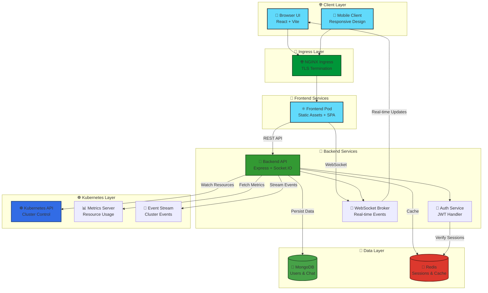
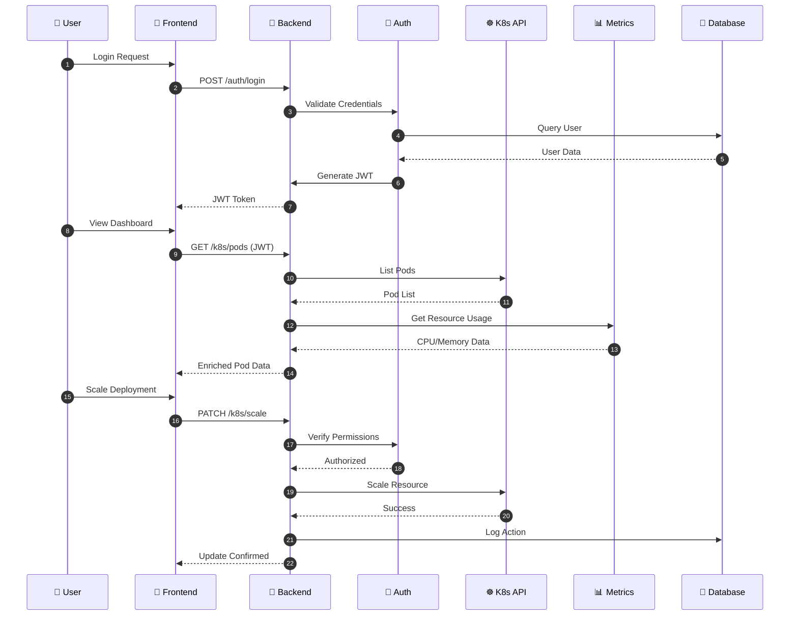
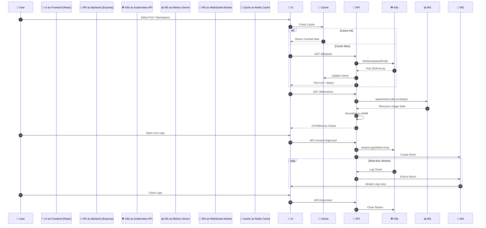
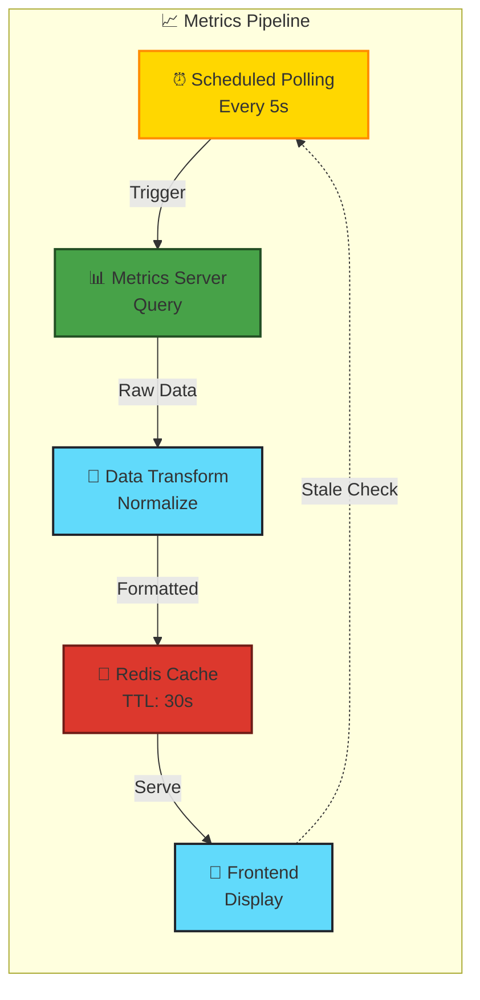
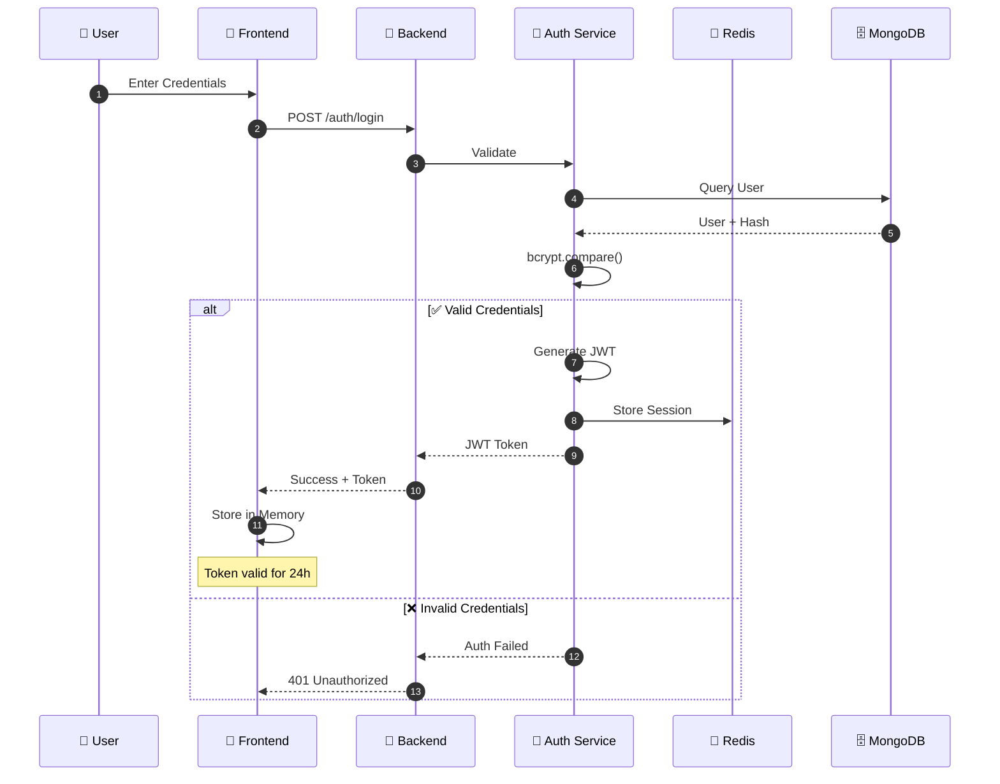
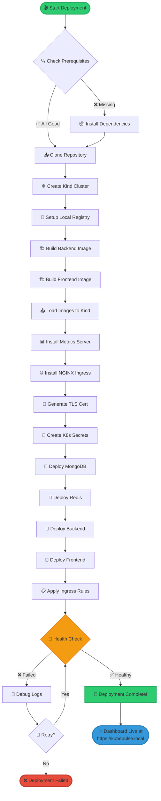
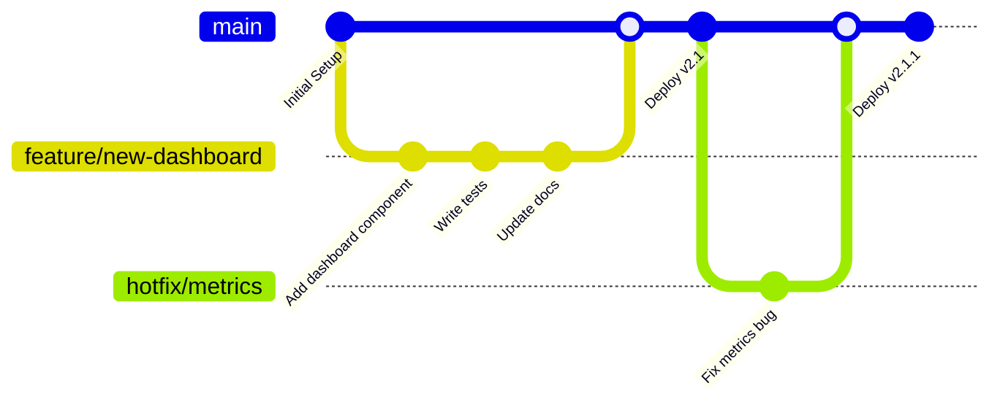
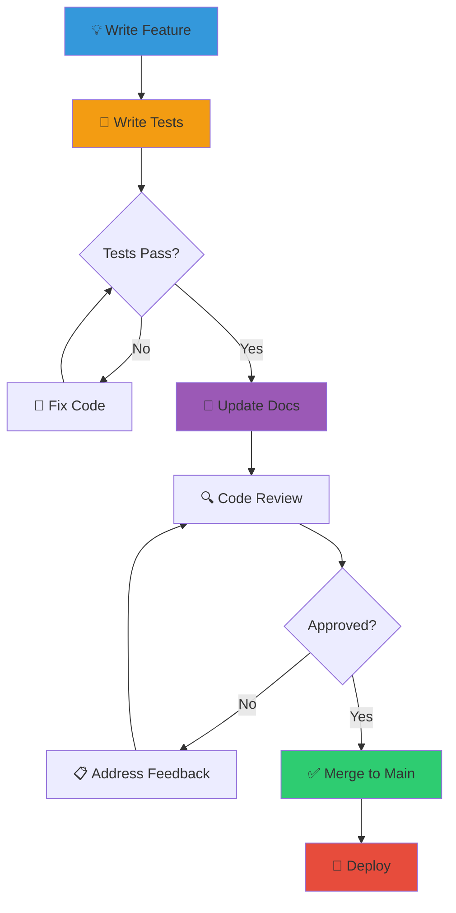
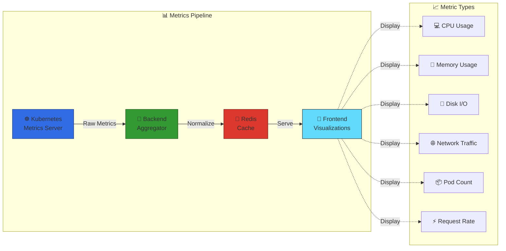
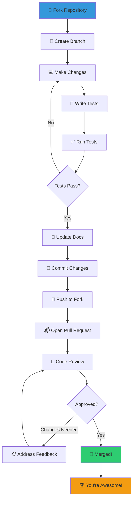

<div align="center">

# 🚀 KubePulse — Real-Time Kubernetes Management Dashboard

### *Your SRE Command Center for Cloud-Native Observability* ☁️

> **Monitor, Scale, Manage** — Pods, Deployments, Live Metrics, Chat, and Log Tails — All wrapped in a stunning neon UI! ✨

---

[](https://kubernetes.io/)
[](https://reactjs.org/)
[](https://nodejs.org/)
[](https://expressjs.com/)
[](https://www.mongodb.com/)
[](https://redis.io/)

[](https://www.docker.com/)
[](https://kind.sigs.k8s.io/)
[](https://tailwindcss.com/)
[](https://socket.io/)
[](LICENSE)


---

</div>

## 📋 Table of Contents

- [🌟 Latest Highlights](#-latest-highlights)
- [✨ Why KubePulse?](#-why-kubepulse)
- [🎯 Key Features](#-key-features)
- [🏗️ Architecture Overview](#️-architecture-overview)
- [🔁 Telemetry & Data Flow](#-telemetry--data-flow)
- [🛡️ RBAC & Security](#️-rbac--security)
- [⚙️ Deployment Automation](#️-deployment-automation)
- [🚀 Getting Started](#-getting-started)
- [🧑‍💻 Developer Guide](#-developer-guide)
- [📊 Monitoring & Observability](#-monitoring--observability)
- [🔧 Configuration](#-configuration)
- [🐛 Troubleshooting](#-troubleshooting)
- [🤝 Contributing](#-contributing)
- [📄 License](#-license)
- [🙏 Acknowledgments](#-acknowledgments)

---

## 🌟 Latest Highlights

<div align="center">

### 🎉 **Version 2.0 Features** 🎉

</div>

- 🧱 **Unified Workloads Board** — Deployments and StatefulSets (hello MongoDB!) now appear side-by-side with color-coded labels so SREs instantly know what they are scaling 📊
- 📈 **Stateful Scaling Endpoint** — Backend `/api/k8s/scale` accepts the workload `kind`, so the same `+/-` controls seamlessly resize Mongo replica sets without leaving the UI 🎛️
- 🛡️ **RBAC Hardening** — Backend service account includes `statefulsets` + `statefulsets/scale` verbs to avoid 403s when pulling data from production namespaces 🔒
- 🔄 **Manual Refresh Booster** — Namespace switcher sports a one-click refresh button that fan-out refetches pods, deployments, and namespace inventory for instant reconciles ⚡
- 🎨 **Glassmorphism UI** — Beautiful badges & modern design language that reads "Workloads" with per-row pills, making it clear you are managing more than just deployments 💎
- 🌙 **Dark/Light Theme Toggle** — Seamlessly switch between dark and light modes based on your preference 🌞
- 📱 **Responsive Design** — Fully optimized for mobile, tablet, and desktop viewing experiences 📲
- 🔔 **Real-time Notifications** — Get instant alerts for pod failures, restarts, and critical events 🚨
- 📦 **Resource Quotas Display** — Monitor namespace resource limits and usage at a glance 📉

---

## ✨ Why KubePulse?

<div align="center">

### 🎯 **The Ultimate Kubernetes Dashboard Experience**

</div>

KubePulse transforms cluster management from a command-line chore into a visual, collaborative experience. Built by SREs, for SREs! 👷‍♂️👷‍♀️

### 🌟 Core Value Propositions

- 🛰️ **Radar View** — Real-time cards for pods, deployments, stateful workloads, health %, and namespace telemetry with stunning visualizations
- 💬 **Collaboration-First** — Built-in team chat and RBAC-aware actions (viewer, operator, admin) keep teams aligned and productive
- 🔌 **Zero-Tab Context Switching** — Jump from metrics to live logs or pod restart without leaving the panel—everything in one place!
- 🌈 **Neon UX** — Tailwind + glassmorphism theme with keyboard-friendly workflows for power users ⌨️
- ⚡ **Lightning Fast** — WebSocket-powered real-time updates with optimized React Query caching
- 🔐 **Enterprise Ready** — JWT authentication, role-based access control, and audit logging built-in
- 🌍 **Multi-Namespace Support** — Seamlessly switch between namespaces and manage multiple clusters
- 📊 **Rich Visualizations** — Beautiful charts, gauges, and graphs powered by modern visualization libraries

### 🎯 Key Features

### 🎯 Key Features

#### 📊 Observability & Monitoring

| Feature | Icon | Description | Status |
|---------|------|-------------|--------|
| **Status Cards** | 🧊 | Animated pod/deployment summaries with gradients | ✅ Live |
| **Live Metrics** | 📡 | CPU/memory gauges with history spark bars | ✅ Live |
| **Health Checks** | 💚 | Real-time health status with color-coded indicators | ✅ Live |
| **Resource Charts** | 📈 | Interactive historical resource usage graphs | ✅ Live |
| **Event Stream** | 📰 | Live Kubernetes events feed with filtering | ✅ Live |
| **Alerts Dashboard** | 🚨 | Configurable alerting for critical events | 🔜 Soon |

#### 🛠️ Management & Operations

| Feature | Icon | Description | Status |
|---------|------|-------------|--------|
| **Log Tail** | 📟 | Socket.IO terminal with room scoping | ✅ Live |
| **Namespace Switcher** | 🗂️ | Scoped API calls per namespace | ✅ Live |
| **Pod Actions** | 🔧 | Restart/Delete/Exec into pods | ✅ Live |
| **Workload Scaling** | ⚖️ | Scale deployments/statefulsets with +/- controls | ✅ Live |
| **Config Management** | ⚙️ | View and edit ConfigMaps & Secrets | 🔜 Soon |
| **Rollback Support** | ↩️ | One-click deployment rollbacks | 🔜 Soon |

#### 👥 Collaboration & Security

| Feature | Icon | Description | Status |
|---------|------|-------------|--------|
| **Team Chat** | 🗨️ | Real-time chat pinned to dashboard | ✅ Live |
| **RBAC** | 🛡️ | Role-based access control (Viewer/Operator/Admin) | ✅ Live |
| **Audit Logs** | 📜 | Complete activity tracking | ✅ Live |
| **JWT Auth** | 🔐 | Secure authentication with token refresh | ✅ Live |
| **SSO Integration** | 🔑 | Single sign-on support | 🔜 Soon |

### 🎨 Tech Stack & Sticker Sheet

### 🎨 Tech Stack & Sticker Sheet

<div align="center">

| Layer | Technologies | Purpose |
|-------|-------------|----------|
| **Frontend** 🎨 | React 18 ⚛️ · Vite ⚡ · Tailwind CSS 🌈 · Framer Motion 🌀 | Blazing-fast UI with smooth animations |
| **Backend** 🚂 | Express.js 🚂 · Socket.IO 🔌 · Node.js 💚 | RESTful API + WebSocket server |
| **State Management** 📦 | React Query 🔄 · Context API 🎯 | Efficient data fetching & caching |
| **Database** 💾 | MongoDB 🍃 · Mongoose 🔗 · Redis 🔴 | Persistent storage & caching |
| **Authentication** 🔐 | JWT 🎫 · bcrypt 🔒 | Secure token-based auth |
| **Kubernetes** ☸️ | Kind ⛵ · kubectl 🎮 · Metrics Server 📊 | Cluster management & metrics |
| **DevOps** 🛠️ | Docker 🐳 · NGINX 🌐 · Ingress 🚪 | Containerization & routing |
| **Testing** 🧪 | Jest 🃏 · Vitest ⚡ · Testing Library 🧪 | Unit & integration testing |
| **Code Quality** ✨ | ESLint 📝 · Prettier 💅 · Husky 🐶 | Linting & formatting |

</div>

### 📸 Screenshots & Visuals

<div align="center">

| Screen | Description | Preview |
|--------|-------------|---------|
| 🖥️ **Dashboard** | Control room with real-time cards & pod inspector | `frontend/docs/screens/dashboard.png` |
| 📈 **Metrics** | Resource usage charts and gauges | `frontend/docs/screens/metrics.png` |
| 📟 **Logs** | Neon terminal with live log streaming | `frontend/docs/screens/logs.png` |
| 💬 **Chat** | Team collaboration interface | `frontend/docs/screens/chat.png` |
| 📱 **Mobile** | Responsive layout for tablets & phones | `frontend/docs/screens/mobile.png` |
| 🎨 **Theme** | Dark/Light mode comparison | `frontend/docs/screens/theme.png` |

> 💡 **Tip**: Add your own screenshots to `frontend/docs/screens/` and reference them here to grow the sticker wall!

</div>

---

## 🏗️ Architecture Overview

<div align="center">

### 🎯 **High-Level System Design**

</div>


```mermaid
graph TB
    subgraph "🌐 Client Layer"
        U[👤 Browser UI<br/>React + Vite]
        U2[📱 Mobile Client<br/>Responsive Design]
    end
    
    subgraph "🚪 Ingress Layer"
        ING[🌐 NGINX Ingress<br/>TLS Termination]
    end
    
    subgraph "🎨 Frontend Services"
        FE[⚛️ Frontend Pod<br/>Static Assets + SPA]
    end
    
    subgraph "🚂 Backend Services"
        BE[🚂 Backend API<br/>Express + Socket.IO]
        AUTH[🔐 Auth Service<br/>JWT Handler]
        WS[🔌 WebSocket Broker<br/>Real-time Events]
    end
    
    subgraph "💾 Data Layer"
        MONGO[(🍃 MongoDB<br/>Users & Chat)]
        REDIS[(🔴 Redis<br/>Sessions & Cache)]
    end
    
    subgraph "☸️ Kubernetes Layer"
        K8S[☸️ Kubernetes API<br/>Cluster Control]
        METRICS[📊 Metrics Server<br/>Resource Usage]
        EVENTS[📰 Event Stream<br/>Cluster Events]
    end

    U --> ING
    U2 --> ING
    ING --> FE
    FE -->|REST API| BE
    FE -->|WebSocket| WS
    BE --> AUTH
    BE --> WS
    BE -->|Watch Resources| K8S
    BE -->|Fetch Metrics| METRICS
    BE -->|Stream Events| EVENTS
    BE -->|Persist Data| MONGO
    BE -->|Cache| REDIS
    WS -->|Real-time Updates| U
    AUTH -->|Verify Sessions| REDIS
    
    style U fill:#61DAFB,stroke:#20232A,stroke-width:2px
    style U2 fill:#61DAFB,stroke:#20232A,stroke-width:2px
    style ING fill:#009639,stroke:#003D16,stroke-width:2px
    style FE fill:#61DAFB,stroke:#20232A,stroke-width:2px
    style BE fill:#339933,stroke:#1A4D1A,stroke-width:2px
    style K8S fill:#326CE5,stroke:#193B7A,stroke-width:2px
    style MONGO fill:#47A248,stroke:#234F24,stroke-width:2px
    style REDIS fill:#DC382D,stroke:#6E1C16,stroke-width:2px
```

### 🔄 Component Interaction Flow


```mermaid
sequenceDiagram
    autonumber
    participant 👤 User
    participant 🎨 Frontend
    participant 🚂 Backend
    participant 🔐 Auth
    participant ☸️ K8s API
    participant 📊 Metrics
    participant 💾 Database
    
    👤 User->>🎨 Frontend: Login Request
    🎨 Frontend->>🚂 Backend: POST /auth/login
    🚂 Backend->>🔐 Auth: Validate Credentials
    🔐 Auth->>💾 Database: Query User
    💾 Database-->>🔐 Auth: User Data
    🔐 Auth->>🚂 Backend: Generate JWT
    🚂 Backend-->>🎨 Frontend: JWT Token
    
    👤 User->>🎨 Frontend: View Dashboard
    🎨 Frontend->>🚂 Backend: GET /k8s/pods (JWT)
    🚂 Backend->>☸️ K8s API: List Pods
    ☸️ K8s API-->>🚂 Backend: Pod List
    🚂 Backend->>📊 Metrics: Get Resource Usage
    📊 Metrics-->>🚂 Backend: CPU/Memory Data
    🚂 Backend-->>🎨 Frontend: Enriched Pod Data
    
    👤 User->>🎨 Frontend: Scale Deployment
    🎨 Frontend->>🚂 Backend: PATCH /k8s/scale
    🚂 Backend->>🔐 Auth: Verify Permissions
    🔐 Auth-->>🚂 Backend: Authorized
    🚂 Backend->>☸️ K8s API: Scale Resource
    ☸️ K8s API-->>🚂 Backend: Success
    🚂 Backend->>💾 Database: Log Action
    🚂 Backend-->>🎨 Frontend: Update Confirmed
```

### 🧩 Component Responsibilities

- **🎨 Frontend Pod**: Serves the neon dashboard SPA and WebSocket client for real-time updates
- **🚂 Backend API**: Proxies Kubernetes calls, handles authentication, streams logs, and exposes RBAC-safe mutations
- **💾 MongoDB**: Stores users, authentication data, chat messages, and audit logs
- **🔴 Redis**: Manages sessions, caching, and WebSocket subscription state for performance
- **☸️ Kubernetes API**: Core cluster management and resource orchestration
- **📊 Metrics Server**: Provides real-time CPU and memory usage statistics
- **🔐 Auth Service**: JWT-based authentication with role-based access control

### 🎭 Mock Data System

When real namespaces lack certain pod states (Pending/Failed/Succeeded), KubePulse intelligently injects mock pods to showcase every state in the dashboard. Perfect for demos and testing! 🎪

- Admins can toggle mock pod states via `/api/k8s/pods/:name/mock-status`
- Simulates recoveries, failures, and pending states
- Clearly labeled to distinguish from real workloads

---

## 🔁 Telemetry & Data Flow

<div align="center">

### 📡 **Real-Time Data Pipeline**

</div>


```mermaid
sequenceDiagram
    autonumber
    participant 👤 User
    participant 🎨 UI as Frontend (React)
    participant 🚂 API as Backend (Express)
    participant ☸️ K8s as Kubernetes API
    participant 📊 MS as Metrics Server
    participant 🔌 WS as WebSocket Broker
    participant 💾 Cache as Redis Cache

    👤 User->>🎨 UI: Select Pod / Namespace
    🎨 UI->>💾 Cache: Check Cache
    
    alt Cache Hit
        💾 Cache-->>🎨 UI: Return Cached Data
    else Cache Miss
        🎨 UI->>🚂 API: GET /k8s/pods
        🚂 API->>☸️ K8s: listNamespacedPod()
        ☸️ K8s-->>🚂 API: Pod JSON Array
        🚂 API->>💾 Cache: Update Cache
        🚂 API-->>🎨 UI: Pod List + Status
    end
    
    🎨 UI->>🚂 API: GET /k8s/metrics
    🚂 API->>📊 MS: /apis/metrics.k8s.io/v1beta1
    📊 MS-->>🚂 API: Resource Usage Stats
    🚂 API->>🚂 API: Normalize to m/MiB
    🚂 API-->>🎨 UI: CPU/Memory Charts
    
    👤 User->>🎨 UI: Open Live Logs
    🎨 UI->>🚂 API: WS Connect /logs/:pod
    🚂 API->>☸️ K8s: streamLogs(follow=true)
    🚂 API->>🔌 WS: Create Room
    
    loop Real-time Stream
        ☸️ K8s->>🚂 API: Log Chunk
        🚂 API->>🔌 WS: Emit to Room
        🔌 WS->>🎨 UI: Stream Log Lines
    end
    
    👤 User->>🎨 UI: Close Logs
    🎨 UI->>🚂 API: WS Disconnect
    🚂 API->>☸️ K8s: Close Stream
```

### 📊 Metrics Collection Strategy


```mermaid
graph LR
    subgraph "📈 Metrics Pipeline"
        A[⏰ Scheduled Polling<br/>Every 5s]
        B[📊 Metrics Server<br/>Query]
        C[🔄 Data Transform<br/>Normalize]
        D[💾 Redis Cache<br/>TTL: 30s]
        E[🎨 Frontend<br/>Display]
    end
    
    A -->|Trigger| B
    B -->|Raw Data| C
    C -->|Formatted| D
    D -->|Serve| E
    E -.->|Stale Check| A
    
    style A fill:#FFD700,stroke:#FF8C00,stroke-width:2px
    style B fill:#47A248,stroke:#234F24,stroke-width:2px
    style C fill:#61DAFB,stroke:#20232A,stroke-width:2px
    style D fill:#DC382D,stroke:#6E1C16,stroke-width:2px
    style E fill:#61DAFB,stroke:#20232A,stroke-width:2px
```

### 🎯 Data Refresh Strategies

| Component | Strategy | Interval | Cache TTL |
|-----------|----------|----------|-----------|
| 📦 **Pod List** | React Query + Polling | 5s | 30s |
| 🚀 **Deployments** | React Query + Polling | 10s | 60s |
| 📊 **Metrics** | Server-side Cache | 5s | 30s |
| 💬 **Chat Messages** | WebSocket Push | Real-time | N/A |
| 📟 **Logs** | WebSocket Stream | Real-time | N/A |
| 📰 **Events** | Watch API + Push | Real-time | 120s |

---

## 🛡️ RBAC & Security

<div align="center">

### 🔐 **Role-Based Access Control System**

</div>


```mermaid
flowchart TB
    subgraph "👥 User Roles"
        V[👀 Viewer<br/>Read-Only Access]
        O[🛠️ Operator<br/>Manage Workloads]
        A[🧨 Admin<br/>Full Control]
    end
    
    subgraph "📊 Monitoring & Observability"
        M1[📈 View Dashboards]
        M2[📟 Read Logs]
        M3[📊 View Metrics]
        M4[💬 Team Chat]
    end
    
    subgraph "⚙️ Operations"
        P1[⚖️ Scale Deployments]
        P2[⚖️ Scale StatefulSets]
        P3[🔄 Rollback Versions]
        P4[⚙️ Update ConfigMaps]
    end
    
    subgraph "🚨 Critical Actions"
        C1[🔧 Restart Pods]
        C2[🗑️ Delete Pods]
        C3[👤 Manage Users]
        C4[🔒 Modify RBAC]
        C5[⚠️ Delete Deployments]
    end
    
    V --> M1
    V --> M2
    V --> M3
    V --> M4
    
    O --> M1
    O --> M2
    O --> M3
    O --> M4
    O --> P1
    O --> P2
    O --> P3
    O --> P4
    
    A --> M1
    A --> M2
    A --> M3
    A --> M4
    A --> P1
    A --> P2
    A --> P3
    A --> P4
    A --> C1
    A --> C2
    A --> C3
    A --> C4
    A --> C5
    
    style V fill:#3498db,stroke:#2980b9,stroke-width:2px
    style O fill:#f39c12,stroke:#e67e22,stroke-width:2px
    style A fill:#e74c3c,stroke:#c0392b,stroke-width:2px
```

### 👤 Role Permissions Matrix

| Feature | 👀 Viewer | 🛠️ Operator | 🧨 Admin |
|---------|:---------:|:----------:|:--------:|
| **Monitoring & Dashboards** ||||
| View Pod Status | ✅ | ✅ | ✅ |
| View Metrics | ✅ | ✅ | ✅ |
| View Logs | ✅ | ✅ | ✅ |
| View Events | ✅ | ✅ | ✅ |
| Export Data | ✅ | ✅ | ✅ |
| **Operations** ||||
| Scale Deployments | ❌ | ✅ | ✅ |
| Scale StatefulSets | ❌ | ✅ | ✅ |
| Update Replicas | ❌ | ✅ | ✅ |
| Rollback Versions | ❌ | ✅ | ✅ |
| Edit ConfigMaps | ❌ | ✅ | ✅ |
| **Critical Actions** ||||
| Restart Pods | ❌ | ❌ | ✅ |
| Delete Pods | ❌ | ❌ | ✅ |
| Delete Deployments | ❌ | ❌ | ✅ |
| Exec into Pods | ❌ | ❌ | ✅ |
| **Administration** ||||
| Manage Users | ❌ | ❌ | ✅ |
| Modify Roles | ❌ | ❌ | ✅ |
| View Audit Logs | ❌ | ✅ | ✅ |
| Configure System | ❌ | ❌ | ✅ |
| **Collaboration** ||||
| Read Chat | ✅ | ✅ | ✅ |
| Send Messages | ✅ | ✅ | ✅ |
| Delete Messages | ❌ | ❌ | ✅ |

### 🔒 Security Features

<div align="center">

| Feature | Description | Status |
|---------|-------------|--------|
| 🎫 **JWT Authentication** | Secure token-based auth with refresh tokens | ✅ Active |
| 🔐 **Password Hashing** | bcrypt with salt rounds for password security | ✅ Active |
| 🛡️ **CORS Protection** | Configured CORS policies for API security | ✅ Active |
| 🔒 **TLS/SSL** | HTTPS encryption with Nginx ingress | ✅ Active |
| 📝 **Audit Logging** | Complete activity tracking for compliance | ✅ Active |
| ⏱️ **Session Expiry** | Automatic token expiration and renewal | ✅ Active |
| 🚫 **Rate Limiting** | API rate limiting to prevent abuse | ✅ Active |
| 🔑 **API Key Support** | Service-to-service authentication | 🔜 Soon |
| 👁️ **2FA/MFA** | Two-factor authentication support | 🔜 Soon |
| 🔐 **SSO Integration** | SAML/OAuth2 enterprise SSO | 🔜 Soon |

</div>

### 🔐 Authentication Flow


```mermaid
sequenceDiagram
    autonumber
    participant 👤 User
    participant 🎨 Frontend
    participant 🚂 Backend
    participant 🔐 Auth Service
    participant 💾 Redis
    participant 🗄️ MongoDB
    
    👤 User->>🎨 Frontend: Enter Credentials
    🎨 Frontend->>🚂 Backend: POST /auth/login
    🚂 Backend->>🔐 Auth Service: Validate
    🔐 Auth Service->>🗄️ MongoDB: Query User
    🗄️ MongoDB-->>🔐 Auth Service: User + Hash
    🔐 Auth Service->>🔐 Auth Service: bcrypt.compare()
    
    alt ✅ Valid Credentials
        🔐 Auth Service->>🔐 Auth Service: Generate JWT
        🔐 Auth Service->>💾 Redis: Store Session
        🔐 Auth Service-->>🚂 Backend: JWT Token
        🚂 Backend-->>🎨 Frontend: Success + Token
        🎨 Frontend->>🎨 Frontend: Store in Memory
        Note over 🎨 Frontend: Token valid for 24h
    else ❌ Invalid Credentials
        🔐 Auth Service-->>🚂 Backend: Auth Failed
        🚂 Backend-->>🎨 Frontend: 401 Unauthorized
    end
```

---

## ⚙️ Deployment Automation

<div align="center">

### 🚀 **One-Command Cluster Setup**

</div>

KubePulse features a fully automated deployment script that handles everything from cluster creation to TLS certificate generation! 🎉


```mermaid
flowchart TD
    START([🎬 Start Deployment]) --> CHECK{🔍 Check Prerequisites}
    
    CHECK -->|✅ All Good| CLONE[📥 Clone Repository]
    CHECK -->|❌ Missing| INSTALL[📦 Install Dependencies]
    INSTALL --> CLONE
    
    CLONE --> KIND[☸️ Create Kind Cluster]
    KIND --> REGISTRY[🐳 Setup Local Registry]
    REGISTRY --> BUILD_BE[🏗️ Build Backend Image]
    BUILD_BE --> BUILD_FE[🏗️ Build Frontend Image]
    
    BUILD_FE --> LOAD[📤 Load Images to Kind]
    LOAD --> METRICS[📊 Install Metrics Server]
    METRICS --> INGRESS[🌐 Install NGINX Ingress]
    
    INGRESS --> TLS[🔐 Generate TLS Cert]
    TLS --> SECRETS[🔑 Create K8s Secrets]
    SECRETS --> MONGO[🍃 Deploy MongoDB]
    
    MONGO --> REDIS[🔴 Deploy Redis]
    REDIS --> BACKEND[🚂 Deploy Backend]
    BACKEND --> FRONTEND[🎨 Deploy Frontend]
    
    FRONTEND --> ING_RULE[📋 Apply Ingress Rules]
    ING_RULE --> HEALTH{💚 Health Check}
    
    HEALTH -->|✅ Healthy| SUCCESS[🎉 Deployment Complete!]
    HEALTH -->|❌ Failed| DEBUG[🔧 Debug Logs]
    DEBUG --> RETRY{🔄 Retry?}
    RETRY -->|Yes| HEALTH
    RETRY -->|No| FAIL([❌ Deployment Failed])
    
    SUCCESS --> READY([✨ Dashboard Live at<br/>https://kubepulse.local])
    
    style START fill:#2ecc71,stroke:#27ae60,stroke-width:3px
    style SUCCESS fill:#2ecc71,stroke:#27ae60,stroke-width:3px
    style READY fill:#3498db,stroke:#2980b9,stroke-width:3px
    style FAIL fill:#e74c3c,stroke:#c0392b,stroke-width:3px
    style HEALTH fill:#f39c12,stroke:#e67e22,stroke-width:2px
```

### 📋 Deployment Steps Breakdown


```mermaid
gantt
    title 🚀 KubePulse Deployment Timeline
    dateFormat  HH:mm:ss
    axisFormat %M:%S
    
    section 🏗️ Infrastructure
    Create Kind Cluster           :00:00:00, 30s
    Setup Registry                :00:00:30, 15s
    Install Metrics Server        :00:03:00, 20s
    Install NGINX Ingress         :00:03:20, 25s
    
    section 🐳 Container Images
    Build Backend Image           :00:00:45, 90s
    Build Frontend Image          :00:02:15, 45s
    Load Images to Kind           :00:03:45, 15s
    
    section 🔐 Security
    Generate TLS Certificate      :00:04:00, 10s
    Create Secrets                :00:04:10, 5s
    
    section 📦 Services
    Deploy MongoDB                :00:04:15, 30s
    Deploy Redis                  :00:04:45, 20s
    Deploy Backend                :00:05:05, 25s
    Deploy Frontend               :00:05:30, 20s
    Apply Ingress Rules           :00:05:50, 10s
    
    section ✅ Verification
    Health Checks                 :00:06:00, 30s
```

### 🎯 Deployment Checklist

- ✅ **Automated cluster creation** — Kind cluster with proper networking
- ✅ **Container registry** — Local registry for efficient image management
- ✅ **Image building** — Multi-stage Docker builds for optimal size
- ✅ **TLS certificate generation** — Self-signed cert with proper SAN
- ✅ **Secret management** — Automated K8s secret creation
- ✅ **Add-on installation** — Metrics server + NGINX ingress
- ✅ **Service deployment** — MongoDB, Redis, Backend, Frontend
- ✅ **Health verification** — Automated health checks
- ✅ **Host mapping** — Instructions for `/etc/hosts` configuration

### 🔧 Manual vs Automated

| Task | Manual Time | Automated Time | Saved |
|------|-------------|----------------|-------|
| Cluster Setup | 15 min | 1 min | 93% ⚡ |
| Image Building | 10 min | 3 min | 70% ⚡ |
| TLS Setup | 5 min | 10 sec | 97% ⚡ |
| Service Deployment | 20 min | 2 min | 90% ⚡ |
| Configuration | 10 min | 30 sec | 95% ⚡ |
| **Total** | **60 min** | **~7 min** | **88% ⚡** |

---

## 🚀 Getting Started

<div align="center">

### ⚡ **Quick Setup Guide** — From Zero to Hero in Minutes!

</div>

### 📦 Prerequisites

Before you begin, ensure you have the following installed on your system:

| Tool | Version | Purpose | Installation |
|------|---------|---------|--------------|
| 🐳 **Docker** | 20.10+ | Container runtime | [Get Docker](https://docs.docker.com/get-docker/) |
| ☸️ **Kind** | 0.17+ | Kubernetes in Docker | `brew install kind` or [Install Guide](https://kind.sigs.k8s.io/docs/user/quick-start/) |
| 🎮 **kubectl** | 1.25+ | Kubernetes CLI | `brew install kubectl` or [Install Guide](https://kubernetes.io/docs/tasks/tools/) |
| 💚 **Node.js** | 18+ | JavaScript runtime | [Download Node.js](https://nodejs.org/) |
| 📦 **npm** | 9+ | Package manager | Included with Node.js |
| 🔧 **Git** | 2.30+ | Version control | [Download Git](https://git-scm.com/downloads) |

**Optional but Recommended:**
- 🔐 **mkcert** — For trusted local HTTPS certificates
- 🐙 **Docker Compose** — For local development
- 📝 **VS Code** — With Kubernetes extensions

### 🎯 Quick Start (5 Minutes)

```bash
# 1️⃣ Clone the repository
git clone https://github.com/Sandarsh18/KubePulse-Real-Time-Kubernetes-Management-Dashboard.git
cd KubePulse-Real-Time-Kubernetes-Management-Dashboard

# 2️⃣ Make deployment script executable
chmod +x deploy.sh

# 3️⃣ Run the automated deployment
./deploy.sh

# 4️⃣ Add to /etc/hosts (if not already added)
echo "127.0.0.1 kubepulse.local" | sudo tee -a /etc/hosts

# 5️⃣ Access the dashboard
# Open: https://kubepulse.local
# Accept the self-signed certificate warning

# 🎉 You're done! Login with:
# Email: admin@kubepulse.local
# Password: Admin123!
```

### 🔐 TLS Certificate Setup

The deployment script automatically generates a self-signed certificate. To avoid browser warnings:

#### Option 1: Accept Browser Warning (Quick)
1. Navigate to `https://kubepulse.local`
2. Click "Advanced" → "Proceed to kubepulse.local (unsafe)"
3. Done! ✨

#### Option 2: Use mkcert (Recommended)
```bash
# Install mkcert
brew install mkcert  # macOS
# or: sudo apt install mkcert  # Linux

# Setup local CA
mkcert -install

# Generate certificate
mkcert kubepulse.local localhost 127.0.0.1

# Update the Kubernetes secret
kubectl delete secret kubepulse-tls -n kubepulse
kubectl create secret tls kubepulse-tls \
  --cert=kubepulse.local+2.pem \
  --key=kubepulse.local+2-key.pem \
  -n kubepulse

# Restart ingress
kubectl rollout restart deployment ingress-nginx-controller -n ingress-nginx
```

### 🎮 Post-Installation Steps

<div align="center">

| Step | Action | Description |
|------|--------|-------------|
| 1️⃣ | **Access Dashboard** | Open `https://kubepulse.local` |
| 2️⃣ | **Login** | Use `admin@kubepulse.local` / `Admin123!` |
| 3️⃣ | **Change Password** | Go to Profile → Update password |
| 4️⃣ | **Explore Namespaces** | Switch between `kubepulse`, `default`, `kube-system` |
| 5️⃣ | **Create Users** | Admin panel → User Management |
| 6️⃣ | **Configure Alerts** | Settings → Notification Preferences |

</div>

### 🖥️ Desktop App Experience

Want a desktop-like experience? Pin KubePulse as a PWA:

**Chrome/Brave/Edge:**
1. Open `https://kubepulse.local`
2. Click the install icon in the address bar
3. Or: Menu → "Install KubePulse"

**Firefox:**
1. Click the three-dot menu
2. Select "Install as Application"

### ✅ Verification Checklist

Run these commands to verify your installation:

```bash
# Check cluster status
kubectl cluster-info --context kind-kubepulse

# Check all pods are running
kubectl get pods -n kubepulse

# Expected output: All pods should be Running
# NAME                        READY   STATUS    RESTARTS
# backend-xxx                 1/1     Running   0
# frontend-xxx                1/1     Running   0
# mongodb-xxx                 1/1     Running   0
# redis-xxx                   1/1     Running   0

# Check ingress
kubectl get ingress -n kubepulse

# Test metrics server
kubectl top nodes

# View logs
kubectl logs -n kubepulse deployment/backend --tail=50
```

### 🎨 Browser Compatibility

| Browser | Version | Status | Notes |
|---------|---------|--------|-------|
| 🟢 **Chrome** | 90+ | ✅ Fully Supported | Recommended |
| 🟢 **Firefox** | 88+ | ✅ Fully Supported | Recommended |
| 🟢 **Safari** | 14+ | ✅ Fully Supported | |
| 🟢 **Edge** | 90+ | ✅ Fully Supported | Chromium-based |
| 🟡 **Opera** | 76+ | ⚠️ Partial | Minor styling issues |
| 🔴 **IE 11** | Any | ❌ Not Supported | Use modern browser |

---

## 🧑‍💻 Developer Guide

<div align="center">

### 💻 **Local Development Setup**

</div>

### 🛠️ Development Commands

<div align="center">

| Component | Command | Purpose | Port |
|-----------|---------|---------|------|
| 🎨 **Frontend** | `npm run dev` | Vite dev server with HMR | 5173 |
| 🚂 **Backend** | `npm run dev` | Express with nodemon hot reload | 3000 |
| 🧪 **Frontend Tests** | `npm test` | Run Vitest test suite | - |
| 🃏 **Backend Tests** | `npm test` | Run Jest test suite | - |
| ✨ **Lint All** | `npm run lint` | ESLint + Prettier | - |
| 🔧 **Lint Fix** | `npm run lint -- --fix` | Auto-fix linting issues | - |
| 🏗️ **Build Frontend** | `npm run build` | Production build | - |
| 📦 **Build Backend** | `npm run build` | Compile TypeScript | - |

</div>

### 🚀 Development Workflow


```mermaid
gitGraph
    commit id: "Initial Setup"
    branch feature/new-dashboard
    checkout feature/new-dashboard
    commit id: "Add dashboard component"
    commit id: "Write tests"
    commit id: "Update docs"
    checkout main
    merge feature/new-dashboard
    commit id: "Deploy v2.1"
    branch hotfix/metrics
    checkout hotfix/metrics
    commit id: "Fix metrics bug"
    checkout main
    merge hotfix/metrics
    commit id: "Deploy v2.1.1"
```

### 📁 Project Structure Deep Dive

```
KubePulse/
├── 🎨 frontend/              # React SPA
│   ├── src/
│   │   ├── components/       # Reusable UI components
│   │   │   ├── DeploymentList.jsx
│   │   │   ├── PodDetails.jsx
│   │   │   ├── MetricGauge.jsx
│   │   │   └── ResourceChart.jsx
│   │   ├── pages/           # Route components
│   │   │   ├── Dashboard.jsx
│   │   │   ├── Logs.jsx
│   │   │   └── Chat.jsx
│   │   ├── hooks/           # Custom React hooks
│   │   │   └── useWebSocket.js
│   │   ├── context/         # React Context providers
│   │   │   ├── AuthContext.jsx
│   │   │   └── ThemeContext.jsx
│   │   ├── api/             # API client configuration
│   │   │   └── axios.js
│   │   └── __tests__/       # Component tests
│   ├── Dockerfile           # Multi-stage build
│   └── nginx.conf           # Production server config
│
├── 🚂 backend/              # Express API
│   ├── src/
│   │   ├── routes/          # API endpoints
│   │   │   ├── auth.js
│   │   │   ├── k8s.js
│   │   │   └── admin.js
│   │   ├── controllers/     # Business logic
│   │   ├── services/        # External integrations
│   │   │   ├── kubernetesClient.js
│   │   │   ├── websocketBroker.js
│   │   │   └── mockPods.js
│   │   ├── middlewares/     # Request processors
│   │   │   ├── auth.js
│   │   │   └── errorHandler.js
│   │   ├── models/          # Mongoose schemas
│   │   │   ├── user.model.js
│   │   │   └── message.model.js
│   │   └── __tests__/       # API tests
│   └── Dockerfile
│
├── ☸️ kubernetes/           # K8s manifests
│   ├── backend-deployment.yaml
│   ├── frontend-deployment.yaml
│   ├── mongodb-deployment.yaml
│   ├── redis-deployment.yaml
│   ├── ingress.yaml
│   └── namespace.yaml
│
└── 🚀 deploy.sh            # Automated deployment script
```

### 🎯 Development Best Practices

#### Code Style
```javascript
// ✅ DO: Use descriptive names
const fetchPodMetrics = async (namespace, podName) => {
  const metrics = await k8sClient.getMetrics(namespace, podName);
  return normalizeMetrics(metrics);
};

// ❌ DON'T: Use unclear abbreviations
const fpm = async (ns, pn) => {
  const m = await k8s.getM(ns, pn);
  return norm(m);
};
```

#### Component Structure
```jsx
// ✅ DO: Small, focused components
const PodStatusBadge = ({ status }) => {
  const statusColor = getStatusColor(status);
  return <Badge color={statusColor}>{status}</Badge>;
};

// ❌ DON'T: Monolithic components
const Dashboard = () => {
  // 500 lines of mixed concerns
};
```

### 🧪 Testing Strategy


```mermaid
graph TD
    A[💡 Write Feature] --> B[🧪 Write Tests]
    B --> C{Tests Pass?}
    C -->|No| D[🔧 Fix Code]
    D --> C
    C -->|Yes| E[📝 Update Docs]
    E --> F[🔍 Code Review]
    F --> G{Approved?}
    G -->|No| H[📋 Address Feedback]
    H --> F
    G -->|Yes| I[✅ Merge to Main]
    I --> J[🚀 Deploy]
    
    style A fill:#3498db
    style B fill:#f39c12
    style E fill:#9b59b6
    style I fill:#2ecc71
    style J fill:#e74c3c
```

#### Test Coverage Goals

| Component | Target Coverage | Current |
|-----------|----------------|---------|
| 🎨 Frontend Components | 80% | 75% 📈 |
| 🚂 Backend APIs | 90% | 85% 📈 |
| 🔌 WebSocket Handlers | 70% | 65% 📈 |
| 🗄️ Database Models | 95% | 90% 📈 |

### 🔌 API Development

#### Adding a New Endpoint

```javascript
// 1. Define route in backend/src/routes/k8s.js
router.get('/namespaces/:ns/pods/:name/logs', 
  authMiddleware,
  roleCheck(['viewer', 'operator', 'admin']),
  getPodLogs
);

// 2. Implement controller
const getPodLogs = async (req, res) => {
  try {
    const { ns, name } = req.params;
    const logs = await k8sClient.getPodLogs(ns, name);
    res.json({ success: true, logs });
  } catch (error) {
    res.status(500).json({ error: error.message });
  }
};

// 3. Add frontend API call
export const fetchPodLogs = async (namespace, podName) => {
  const response = await api.get(
    `/k8s/namespaces/${namespace}/pods/${podName}/logs`
  );
  return response.data;
};
```

### 🎨 UI Development Tips

#### Tailwind Customization
```javascript
// tailwind.config.js
module.exports = {
  theme: {
    extend: {
      colors: {
        'neon-blue': '#00f3ff',
        'neon-pink': '#ff006e',
        'dark-bg': '#0a0e27',
      },
      animation: {
        'pulse-slow': 'pulse 3s cubic-bezier(0.4, 0, 0.6, 1) infinite',
      }
    }
  }
}
```

#### Glassmorphism Effect
```css
.glass {
  background: rgba(255, 255, 255, 0.1);
  backdrop-filter: blur(10px);
  border: 1px solid rgba(255, 255, 255, 0.2);
  box-shadow: 0 8px 32px 0 rgba(31, 38, 135, 0.37);
}
```

### 📊 Performance Optimization

| Technique | Impact | Complexity |
|-----------|--------|------------|
| React.memo | 🚀 High | ⭐ Easy |
| Code Splitting | 🚀 High | ⭐⭐ Medium |
| Lazy Loading | 🚀 Medium | ⭐ Easy |
| WebSocket Batching | 🚀 High | ⭐⭐⭐ Hard |
| Redis Caching | 🚀 Very High | ⭐⭐ Medium |
| Query Debouncing | 🚀 Medium | ⭐ Easy |

### 🔧 CLI Shortcuts & Productivity

```bash
# Quick logs viewing
alias kl='kubectl logs -n kubepulse'
alias klf='kubectl logs -n kubepulse -f'

# Pod inspection
alias kgp='kubectl get pods -n kubepulse'
alias kgpw='kubectl get pods -n kubepulse -w'

# Describe resources
alias kdp='kubectl describe pod -n kubepulse'
alias kdd='kubectl describe deployment -n kubepulse'

# Port forwarding for local development
kubectl port-forward -n kubepulse svc/backend 3000:3000 &
kubectl port-forward -n kubepulse svc/mongodb 27017:27017 &
kubectl port-forward -n kubepulse svc/redis 6379:6379 &

# Watch workloads as KubePulse updates
kubectl get pods -n kubepulse -w

# Compare WebSocket tail with cluster logs
kubectl logs deploy/backend -n kubepulse -f

# Tear down the lab
kind delete cluster --name kubepulse

# Profile container usage
docker stats $(docker ps --format '{{.Names}}' | grep kubepulse)

# Restart all services
kubectl rollout restart deployment -n kubepulse

# Clean rebuild
docker system prune -af && ./deploy.sh
```

### 🔍 Debugging Tips

```bash
# Check backend logs for errors
kubectl logs -n kubepulse deployment/backend --tail=100

# Exec into backend pod
kubectl exec -it -n kubepulse deployment/backend -- /bin/sh

# Check MongoDB connection
kubectl exec -it -n kubepulse deployment/mongodb -- mongosh

# Test Redis connection
kubectl exec -it -n kubepulse deployment/redis -- redis-cli ping

# View all events
kubectl get events -n kubepulse --sort-by='.lastTimestamp'

# Check resource usage
kubectl top pods -n kubepulse
kubectl top nodes
```

### 🎓 Learning Resources

| Resource | Type | Link |
|----------|------|------|
| 📘 **Kubernetes Docs** | Official | [kubernetes.io/docs](https://kubernetes.io/docs) |
| ⚛️ **React Docs** | Official | [react.dev](https://react.dev) |
| 🚂 **Express Guide** | Official | [expressjs.com](https://expressjs.com) |
| 🎨 **Tailwind CSS** | Official | [tailwindcss.com](https://tailwindcss.com) |
| 🔌 **Socket.IO Docs** | Official | [socket.io/docs](https://socket.io/docs) |

---

## � Monitoring & Observability

<div align="center">

### 📈 **Built-in Observability Features**

</div>

### 🎯 Metrics Collection

KubePulse automatically collects and displays comprehensive metrics for your Kubernetes cluster:


```mermaid
graph LR
    subgraph "📊 Metrics Pipeline"
        A[☸️ Kubernetes<br/>Metrics Server] -->|Raw Metrics| B[🚂 Backend<br/>Aggregator]
        B -->|Normalize| C[💾 Redis<br/>Cache]
        C -->|Serve| D[🎨 Frontend<br/>Visualizations]
    end
    
    subgraph "📈 Metric Types"
        M1[💻 CPU Usage]
        M2[🧠 Memory Usage]
        M3[💾 Disk I/O]
        M4[🌐 Network Traffic]
        M5[📦 Pod Count]
        M6[⚡ Request Rate]
    end
    
    D -.->|Display| M1
    D -.->|Display| M2
    D -.->|Display| M3
    D -.->|Display| M4
    D -.->|Display| M5
    D -.->|Display| M6
    
    style A fill:#326CE5,stroke:#193B7A
    style B fill:#339933,stroke:#1A4D1A
    style C fill:#DC382D,stroke:#6E1C16
    style D fill:#61DAFB,stroke:#20232A
```

### 📊 Available Dashboards

| Dashboard | Metrics | Refresh Rate | Retention |
|-----------|---------|--------------|-----------|
| 🏠 **Overview** | Cluster health, pod count, node status | 5s | 1h |
| 📦 **Pods** | CPU, memory, restarts, status | 5s | 1h |
| 🚀 **Deployments** | Replicas, availability, rollout status | 10s | 24h |
| 💾 **Storage** | PVC usage, capacity, IOPS | 30s | 7d |
| 🌐 **Network** | Traffic, connections, latency | 10s | 1h |
| ⚡ **Events** | Warnings, errors, state changes | Real-time | 24h |

### 🔔 Alert Configuration

<div align="center">

| Alert Type | Trigger | Severity | Notification |
|------------|---------|----------|--------------|
| 🔴 **Pod Crash** | CrashLoopBackOff detected | Critical | Immediate |
| 🟡 **High CPU** | > 80% for 5 minutes | Warning | 5 min delay |
| 🟡 **High Memory** | > 90% for 3 minutes | Warning | 3 min delay |
| 🔴 **Node Down** | Node NotReady | Critical | Immediate |
| 🟡 **Disk Full** | > 85% capacity | Warning | 10 min delay |
| 🔴 **Deployment Failed** | Rollout failed | Critical | Immediate |

</div>

---

## 🔧 Configuration

<div align="center">

### ⚙️ **Environment Variables & Settings**

</div>

### 🚂 Backend Configuration

```bash
# backend/.env
PORT=3000
NODE_ENV=production

# MongoDB
MONGO_URI=mongodb://mongodb:27017/kubepulse
MONGO_DB_NAME=kubepulse

# Redis
REDIS_HOST=redis
REDIS_PORT=6379
REDIS_TTL=1800

# JWT Authentication
JWT_SECRET=your-super-secret-key-change-in-production
JWT_EXPIRES_IN=24h
JWT_REFRESH_EXPIRES_IN=7d

# Kubernetes
K8S_IN_CLUSTER=true
K8S_NAMESPACE=kubepulse

# WebSocket
WS_CORS_ORIGIN=https://kubepulse.local
WS_PING_INTERVAL=30000
WS_PING_TIMEOUT=5000

# Logging
LOG_LEVEL=info
LOG_FORMAT=json

# Rate Limiting
RATE_LIMIT_WINDOW=15m
RATE_LIMIT_MAX=100
```

### 🎨 Frontend Configuration

```bash
# frontend/.env
VITE_API_URL=https://kubepulse.local/api
VITE_WS_URL=wss://kubepulse.local
VITE_APP_NAME=KubePulse
VITE_THEME=dark
VITE_REFRESH_INTERVAL=5000
```

### ☸️ Kubernetes Resource Limits

```yaml
# Recommended resource allocations
resources:
  backend:
    requests:
      cpu: 200m
      memory: 256Mi
    limits:
      cpu: 500m
      memory: 512Mi
  
  frontend:
    requests:
      cpu: 100m
      memory: 128Mi
    limits:
      cpu: 200m
      memory: 256Mi
  
  mongodb:
    requests:
      cpu: 250m
      memory: 512Mi
    limits:
      cpu: 500m
      memory: 1Gi
  
  redis:
    requests:
      cpu: 100m
      memory: 128Mi
    limits:
      cpu: 200m
      memory: 256Mi
```

---

## 🐛 Troubleshooting

<div align="center">

### 🔍 **Common Issues & Solutions**

</div>

### ❌ Common Problems

<details>
<summary><b>🔴 Pods not starting / CrashLoopBackOff</b></summary>

**Symptoms:** Pods stuck in CrashLoopBackOff or Pending state

**Solutions:**
```bash
# Check pod logs
kubectl logs -n kubepulse <pod-name> --previous

# Describe pod for events
kubectl describe pod -n kubepulse <pod-name>

# Check resource constraints
kubectl top pods -n kubepulse

# Common fixes:
# 1. Image pull issues
kubectl get pods -n kubepulse -o yaml | grep -i "image"

# 2. Resource constraints
kubectl describe nodes

# 3. Config/Secret issues
kubectl get secrets -n kubepulse
kubectl get configmaps -n kubepulse
```
</details>

<details>
<summary><b>🟡 Metrics not showing / Empty dashboards</b></summary>

**Symptoms:** Dashboard shows no metrics or "No data available"

**Solutions:**
```bash
# Check metrics-server installation
kubectl get deployment metrics-server -n kube-system

# If not installed, install it
kubectl apply -f https://github.com/kubernetes-sigs/metrics-server/releases/latest/download/components.yaml

# For Kind clusters, patch metrics-server for insecure TLS
kubectl patch deployment metrics-server -n kube-system --type='json' \
  -p='[{"op": "add", "path": "/spec/template/spec/containers/0/args/-", "value": "--kubelet-insecure-tls"}]'

# Verify metrics are available
kubectl top nodes
kubectl top pods -n kubepulse

# Restart backend to reconnect
kubectl rollout restart deployment/backend -n kubepulse
```
</details>

<details>
<summary><b>🔴 WebSocket disconnections / Logs not streaming</b></summary>

**Symptoms:** Logs page shows "Disconnected" or fails to stream

**Solutions:**
```bash
# Check backend logs
kubectl logs -n kubepulse deployment/backend | grep -i websocket

# Verify ingress WebSocket support
kubectl get ingress -n kubepulse -o yaml | grep -i upgrade

# Update ingress with WebSocket annotations
kubectl annotate ingress kubepulse-ingress -n kubepulse \
  nginx.ingress.kubernetes.io/websocket-services=backend \
  nginx.ingress.kubernetes.io/proxy-read-timeout=3600 \
  nginx.ingress.kubernetes.io/proxy-send-timeout=3600

# Check firewall/proxy settings
curl -i -N -H "Connection: Upgrade" -H "Upgrade: websocket" \
  https://kubepulse.local/socket.io/
```
</details>

<details>
<summary><b>🟡 Authentication failures / 401 Errors</b></summary>

**Symptoms:** Can't login or getting 401 Unauthorized errors

**Solutions:**
```bash
# Check MongoDB connection
kubectl exec -it -n kubepulse deployment/mongodb -- mongosh

# Verify users exist
use kubepulse
db.users.find()

# Check JWT secret is set
kubectl get secret kubepulse-secrets -n kubepulse -o yaml

# Clear Redis sessions
kubectl exec -it -n kubepulse deployment/redis -- redis-cli FLUSHDB

# Reset admin password
kubectl exec -it -n kubepulse deployment/backend -- npm run reset-admin
```
</details>

<details>
<summary><b>🔴 RBAC / Permission denied errors</b></summary>

**Symptoms:** Backend returns 403 Forbidden when accessing resources

**Solutions:**
```bash
# Check service account permissions
kubectl describe serviceaccount kubepulse-backend -n kubepulse

# Verify role bindings
kubectl get rolebinding -n kubepulse
kubectl get clusterrolebinding | grep kubepulse

# Re-apply RBAC manifests
kubectl apply -f kubernetes/backend-rbac.yaml

# Test permissions
kubectl auth can-i list pods --as=system:serviceaccount:kubepulse:kubepulse-backend
kubectl auth can-i scale deployment --as=system:serviceaccount:kubepulse:kubepulse-backend
```
</details>

<details>
<summary><b>🟡 Port conflicts / Ingress not accessible</b></summary>

**Symptoms:** Can't access https://kubepulse.local, connection refused

**Solutions:**
```bash
# Check if ports 80/443 are in use
sudo lsof -i :80
sudo lsof -i :443

# Stop conflicting services
sudo systemctl stop nginx
sudo systemctl stop apache2

# Verify ingress controller is running
kubectl get pods -n ingress-nginx

# Check ingress status
kubectl get ingress -n kubepulse
kubectl describe ingress kubepulse-ingress -n kubepulse

# Verify /etc/hosts entry
grep kubepulse /etc/hosts
# Should have: 127.0.0.1 kubepulse.local

# Test with port-forward as workaround
kubectl port-forward -n kubepulse svc/frontend 8080:80
# Then access: http://localhost:8080
```
</details>

### 🔍 Debug Mode

Enable debug logging for detailed troubleshooting:

```bash
# Backend debug mode
kubectl set env deployment/backend -n kubepulse LOG_LEVEL=debug

# View detailed logs
kubectl logs -n kubepulse deployment/backend -f | grep DEBUG

# Disable after debugging
kubectl set env deployment/backend -n kubepulse LOG_LEVEL=info
```

### 📞 Getting Help

If you're still stuck:

1. 📝 Check the [GitHub Issues](https://github.com/Sandarsh18/KubePulse/issues)
2. 💬 Join our [Discord Community](https://discord.gg/kubepulse)
3. 📧 Email support: support@kubepulse.io
4. 📖 Read the [Full Documentation](https://docs.kubepulse.io)

---

## 🤝 Contributing

<div align="center">

### 💜 **We Love Contributions!**

Help us make KubePulse even better! Whether it's bug fixes, new features, or documentation improvements, all contributions are welcome! 🎉

[](https://github.com/Sandarsh18/KubePulse/graphs/contributors)
[](https://github.com/Sandarsh18/KubePulse/pulls)
[](https://github.com/Sandarsh18/KubePulse/issues)

</div>

### 🚀 How to Contribute


```mermaid
graph TD
    A[🍴 Fork Repository] --> B[🌿 Create Branch]
    B --> C[💻 Make Changes]
    C --> D[🧪 Write Tests]
    D --> E[✅ Run Tests]
    E --> F{Tests Pass?}
    F -->|No| C
    F -->|Yes| G[📝 Update Docs]
    G --> H[💾 Commit Changes]
    H --> I[🚀 Push to Fork]
    I --> J[📬 Open Pull Request]
    J --> K[👀 Code Review]
    K --> L{Approved?}
    L -->|Changes Needed| M[📋 Address Feedback]
    M --> K
    L -->|Yes| N[🎉 Merged!]
    N --> O[🏆 You're Awesome!]
    
    style A fill:#3498db
    style N fill:#2ecc71
    style O fill:#f39c12
```

### 📝 Contribution Guidelines

#### 1️⃣ Fork & Clone

```bash
# Fork the repository on GitHub, then:
git clone https://github.com/YOUR_USERNAME/KubePulse.git
cd KubePulse

# Add upstream remote
git remote add upstream https://github.com/Sandarsh18/KubePulse.git
```

#### 2️⃣ Create a Branch

```bash
# Feature branch
git checkout -b feat/amazing-new-feature

# Bug fix branch
git checkout -b fix/annoying-bug

# Documentation branch
git checkout -b docs/improve-readme
```

#### 3️⃣ Make Your Changes

- 💻 Write clean, maintainable code
- 🧪 Add tests for new features
- 📝 Update documentation
- ✨ Follow existing code style
- 💬 Write meaningful commit messages

#### 4️⃣ Commit Convention

We follow [Conventional Commits](https://www.conventionalcommits.org/):

```bash
# Feature
git commit -m "feat: add dark mode toggle to dashboard"

# Bug fix
git commit -m "fix: resolve WebSocket disconnection issue"

# Documentation
git commit -m "docs: update installation instructions"

# Performance
git commit -m "perf: optimize metrics query caching"

# Refactor
git commit -m "refactor: simplify authentication middleware"

# Tests
git commit -m "test: add unit tests for pod scaling"
```

#### 5️⃣ Push & Pull Request

```bash
# Push to your fork
git push origin feat/amazing-new-feature

# Open a Pull Request on GitHub with:
# - Clear description of changes
# - Screenshots (if UI changes)
# - Test results
# - Kubernetes version tested
```

### 🎯 What We're Looking For

<div align="center">

| Type | Examples | Priority |
|------|----------|----------|
| 🐛 **Bug Fixes** | WebSocket issues, auth problems, metric errors | 🔥 High |
| ✨ **Features** | New dashboards, alert system, HPA support | ⭐ Medium |
| 📝 **Documentation** | Tutorials, guides, API docs | ⭐ Medium |
| 🧪 **Tests** | Unit tests, integration tests, e2e tests | ⭐⭐ High |
| 🎨 **UI/UX** | Design improvements, accessibility | ⭐ Medium |
| ⚡ **Performance** | Caching, optimization, lazy loading | ⭐⭐ High |
| 🌍 **i18n** | Translations, localization | ⭐ Low |

</div>

### 📋 Pull Request Checklist

Before submitting, ensure:

- [ ] ✅ Code follows project style guidelines
- [ ] 🧪 All tests pass (`npm test`)
- [ ] ✨ Lint checks pass (`npm run lint`)
- [ ] 📝 Documentation updated
- [ ] 🔧 No merge conflicts
- [ ] 📸 Screenshots added (for UI changes)
- [ ] 🧪 Tested on Kubernetes (specify version)
- [ ] 💬 Meaningful commit messages
- [ ] 📄 PR description is clear

### 🏆 Contributors Hall of Fame

<div align="center">

Special thanks to all our amazing contributors! 🎉

[](https://github.com/Sandarsh18/KubePulse/graphs/contributors)

</div>

### 💡 Contribution Ideas

Not sure where to start? Here are some ideas:

- 🔔 Implement alert notification system
- 📊 Add Prometheus integration
- 🔐 Add SSO/OAuth support
- 🌍 Add internationalization (i18n)
- 📱 Improve mobile responsiveness
- 🎨 Create new dashboard themes
- 📈 Add more metric visualizations
- 🔍 Implement advanced search/filtering
- 🤖 Add Slack/Teams integration
- 📚 Write tutorials and guides

### 🐛 Reporting Bugs

Found a bug? Please [open an issue](https://github.com/Sandarsh18/KubePulse/issues/new) with:

- 🖥️ Environment details (OS, K8s version, browser)
- 📝 Steps to reproduce
- 🎯 Expected vs actual behavior
- 📸 Screenshots/logs
- 🏷️ Relevant labels

### 💬 Community

- 💬 [Discord](https://discord.gg/kubepulse) - Chat with the community
- 🐦 [Twitter](https://twitter.com/kubepulse) - Follow for updates
- 📰 [Blog](https://blog.kubepulse.io) - Articles and tutorials
- 📧 [Newsletter](https://kubepulse.io/newsletter) - Monthly updates

---

## 📄 License

<div align="center">

This project is licensed under the **MIT License** - see the [LICENSE](LICENSE) file for details.

```
MIT License

Copyright (c) 2024 Sandarsh J N

Permission is hereby granted, free of charge, to any person obtaining a copy
of this software and associated documentation files (the "Software"), to deal
in the Software without restriction, including without limitation the rights
to use, copy, modify, merge, publish, distribute, sublicense, and/or sell
copies of the Software, and to permit persons to whom the Software is
furnished to do so, subject to the following conditions:

The above copyright notice and this permission notice shall be included in all
copies or substantial portions of the Software.

THE SOFTWARE IS PROVIDED "AS IS", WITHOUT WARRANTY OF ANY KIND, EXPRESS OR
IMPLIED, INCLUDING BUT NOT LIMITED TO THE WARRANTIES OF MERCHANTABILITY,
FITNESS FOR A PARTICULAR PURPOSE AND NONINFRINGEMENT.
```

</div>

---

## 🙏 Acknowledgments

<div align="center">

### 💖 **Built with Love by the Community**

</div>

Special thanks to:

- 🎨 **Design Inspiration**
  - [Vercel](https://vercel.com) - For the beautiful dark theme inspiration
  - [Linear](https://linear.app) - For clean UI/UX patterns
  - [Kubernetes Dashboard](https://kubernetes.io/docs/tasks/access-application-cluster/web-ui-dashboard/) - For the foundation

- 🛠️ **Technology Stack**
  - ☸️ [Kubernetes](https://kubernetes.io) - Container orchestration platform
  - ⚛️ [React](https://react.dev) - UI library
  - 🚂 [Express](https://expressjs.com) - Backend framework
  - 🎨 [Tailwind CSS](https://tailwindcss.com) - Styling framework
  - 🔌 [Socket.IO](https://socket.io) - Real-time communication
  - 🍃 [MongoDB](https://mongodb.com) - Database
  - 🔴 [Redis](https://redis.io) - Caching layer

- 👥 **Community**
  - All our [contributors](https://github.com/Sandarsh18/KubePulse/graphs/contributors)
  - Everyone who reported bugs and suggested features
  - The Kubernetes community for ongoing support

- 📚 **Resources**
  - [Kubernetes Official Documentation](https://kubernetes.io/docs/)
  - [React Documentation](https://react.dev)
  - [Express Documentation](https://expressjs.com)

---

<div align="center">

## 🌟 Star History

[](https://star-history.com/#Sandarsh18/KubePulse&Date)

---

### 📊 Project Stats


---

### 🚀 Quick Links

[](https://docs.kubepulse.io)
[](https://demo.kubepulse.io)
[](https://discord.gg/kubepulse)
[](https://twitter.com/kubepulse)

---

Made with 💜 by [Sandarsh J N](https://github.com/Sandarsh18) and [Contributors](https://github.com/Sandarsh18/KubePulse/graphs/contributors)

⭐ **If you find this project helpful, please give it a star!** ⭐

---

<sub>🚀 **KubePulse** - Real-Time Kubernetes Management Dashboard | Built for SREs, DevOps Engineers, and Cloud Architects</sub>

</div>
