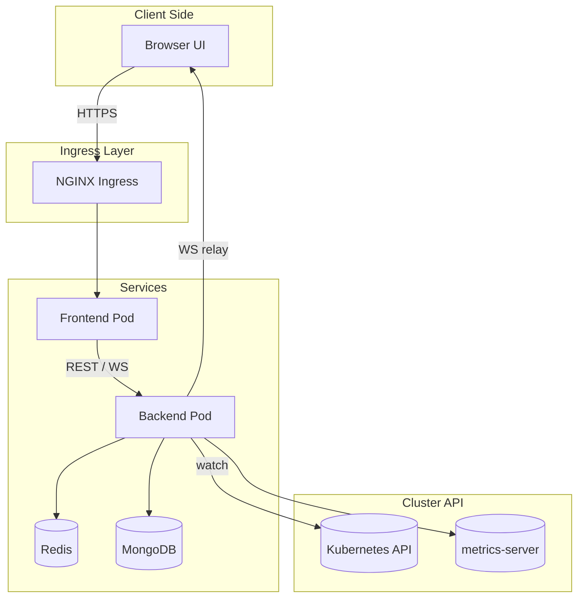
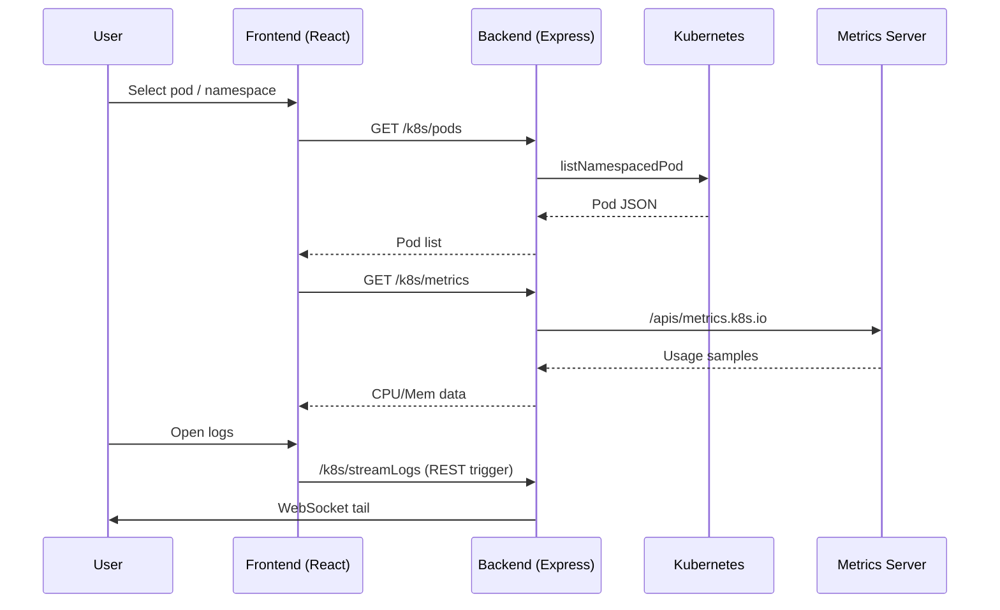
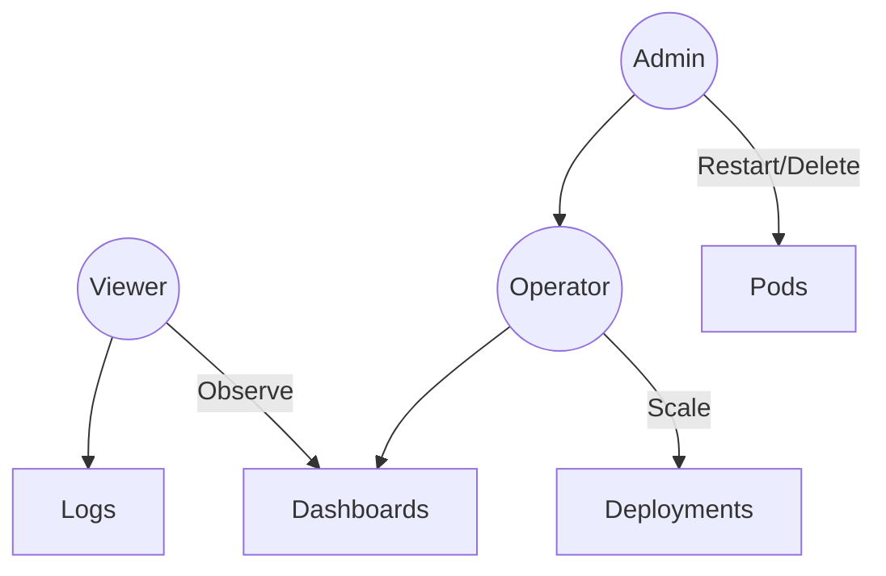

# KubePulse — Real-Time Kubernetes Management Dashboard 🚀

> **SRE command center** for pods, deployments, live metrics, chat, and log tails — all wrapped in a neon UI.


## 📋 Contents

1. [Why KubePulse?](#-why-kubepulse)
2. [Architecture](#-architecture)
3. [Telemetry Flow](#-telemetry-flow)
4. [Deployment Automation](#-deployment-automation)
5. [Getting Started](#-getting-started)
6. [Developer Experience](#-developer-experience)
7. [Operational Notes](#-operational-notes)

## ✨ Why KubePulse?

- 🛰️ **Radar View** — Real-time cards for pods, deployments, health %, and namespace telemetry.
- 💬 **Collab-first** — Chat and RBAC-aware actions (viewer, operator, admin) keep teams aligned.
- 🔌 **Zero-tab context** — Jump from metrics to live logs or pod restart without leaving the panel.
- 🌈 **Neon UX** — Tailwind + glassmorphism theme with keyboard-friendly workflows.

### Feature Matrix

| Badge | Capability | Notes |
| --- | --- | --- |
| 🧊 Status Cards | Animated pod/deployment summaries with gradients | Auto-refresh via React Query polling |
| 📡 Live Metrics | CPU/memory gauges with history spark bars | Backed by metrics-server, normalized to m/MiB |
| 📟 Log Tail | Socket.IO terminal with room scoping | Supports container follow + clear | 
| 🗂️ Namespace Switcher | Scoped API calls per namespace | Filters lists + metrics synchronously |
| 🛠️ Admin Actions | Restart/Delete pod, scale deployments | Guarded by JWT + role middleware |
| 🗨️ Team Chat | Real-time thread pinned to dashboard | Persists to MongoDB |

### Tech Sticker Sheet

| Layer | Tools |
| --- | --- |
| UI | React + Vite ⚛️ · Tailwind CSS 🎨 · Framer Motion 🌀 |
| API | Express 🚂 · Socket.IO 🔌 · Mongoose 🍃 |
| Data | MongoDB 🍃 · Redis 🔴 |
| Cluster | Kind ⛵ · NGINX 🌀 · Metrics Server 📈 |

### Screens & Stickers

- 🖥️ `frontend/docs/screens/dashboard.png` — Control room cards + pod inspector.
- 📈 `frontend/docs/screens/logs.png` — Neon terminal with live log tail.
- 📲 `frontend/docs/screens/mobile.png` — Responsive layout for tablets.
Add your own screenshots to `frontend/docs/screens/` and reference them here to grow the sticker wall.

## 🧭 Architecture


```mermaid
graph TB
	subgraph Client Side
		U[Browser UI]
	end
	subgraph Ingress Layer
		ING[NGINX Ingress]
	end
	subgraph Services
		FE[Frontend Pod]
		BE[Backend Pod]
		REDIS[(Redis)]
		MONGO[(MongoDB)]
	end
	subgraph Cluster API
		K8S[(Kubernetes API)]
		METRICS[(metrics-server)]
	end

	U -->|HTTPS| ING
	ING --> FE
	FE -->|REST / WS| BE
	BE -->|watch| K8S
	BE --> METRICS
	BE --> MONGO
	BE --> REDIS
	BE -->|WS relay| U
```

- **Frontend** serves the neon dashboard and WebSocket client.
- **Backend** proxies Kubernetes calls, streams logs, and exposes RBAC-safe mutations.
- **MongoDB/Redis** hold users, sessions, chat, and subscription state.

## 🔁 Telemetry Flow


```mermaid
sequenceDiagram
	participant User
	participant UI as Frontend (React)
	participant API as Backend (Express)
	participant K8s as Kubernetes
	participant MS as Metrics Server

	User->>UI: Select pod / namespace
	UI->>API: GET /k8s/pods
	API->>K8s: listNamespacedPod
	K8s-->>API: Pod JSON
	API-->>UI: Pod list
	UI->>API: GET /k8s/metrics
	API->>MS: /apis/metrics.k8s.io
	MS-->>API: Usage samples
	API-->>UI: CPU/Mem data
	User->>UI: Open logs
	UI->>API: /k8s/streamLogs (REST trigger)
	API->>User: WebSocket tail
```

## 🛡️ RBAC & Actions


```mermaid
flowchart TB
	Viewer((Viewer)) -->|Observe| Metrics[Dashboards]
	Viewer --> Logs[Logs]
	Operator((Operator)) -->|Scale| Deployments
	Operator --> Metrics
	Admin((Admin)) -->|Restart/Delete| Pods
	Admin --> Operator
```

| Role | Icon | Permissions |
| --- | --- | --- |
| Viewer | 👀 | Read-only dashboards, logs, chat |
| Operator | 🛠️ | Viewer rights + scale deployments |
| Admin | 🧨 | Operator rights + restart/delete pods, manage users |

## ⚙️ Deployment Automation


```mermaid
flowchart LR
	clone[Clone repo] --> deps[Check prerequisites]
	deps --> kind[Create Kind cluster]
	kind --> build[Build Docker images]
	build --> load[Load images into Kind]
	load --> addons[Install ingress + metrics]
	addons --> tls[Create TLS secret]
	tls --> apply[Apply manifests]
	apply --> ready[Dashboard live ✅]
```

- Single `deploy.sh` script orchestrates cluster creation, builds, secret generation, and ingress publishing.
- Host port mapping exposes `https://kubepulse.local` (remember to trust the self-signed cert).
- Stickers to watch for: ✅ logs will say *"Dashboard live"*, ⚠️ indicates a manual step (accept certificate), ❌ stops the script if dependencies missing.

## 🚀 Getting Started

### Prerequisites

- Docker
- Kind (Kubernetes-in-Docker)
- kubectl
- Node.js 18+
- Optional: `mkcert` or your own CA if you want trusted local HTTPS

### Quick start checklist

```bash
git clone https://github.com/Sandarsh18/KubePulse-Real-Time-Kubernetes-Management-Dashboard.git
cd KubePulse-Real-Time-Kubernetes-Management-Dashboard
chmod +x deploy.sh
./deploy.sh
```

1. Accept the self-signed warning when opening `https://kubepulse.local`.
2. Log in with the bootstrap admin created by the script (`admin@kubepulse.local / Admin123!`).
3. Use the namespace selector to switch between `kubepulse`, `default`, or `kube-system`.
4. (Optional) Pin `kubepulse.local` as an app shortcut in Brave/Chrome for a desktop-like feel 🖱️.

### TLS certificate

The script generates a self-signed certificate. Browsers will flag it as untrusted the first time—proceed and add an exception. If you need a trusted certificate, update `kubernetes/ingress.yaml` and the TLS secret creation logic with your own CA or wildcard cert.

## 🧑‍💻 Developer Experience

| Command | Purpose |
| --- | --- |
| `npm install` (backend/frontend) | Install dependencies |
| `npm run dev` (frontend) | Vite dev server with proxy to backend |
| `npm run dev` (backend) | Node/Express hot reload via nodemon |
| `npm test` | Run Jest + Vitest suites |
| `npm run lint` | Static analysis for both tiers |

Tips:
- Use VS Code tasks or `npm run dev -- --host` for LAN previews.
- Tailwind tokens live in `frontend/src/index.css`; extend them instead of hard-coding colors.
- WebSocket helpers are shared via `frontend/src/hooks/useWebSocket.js`.
- Need the whole stack locally? Run `npm run dev --workspace frontend` and `npm run dev --workspace backend` in parallel, or use the provided VS Code multi-root `/.vscode/launch.json` template.
- 🎯 Quick lint fix: `npm run lint -- --fix`.

### CLI Shortcuts

- `kubectl get pods -n kubepulse -w` — Watch workloads as KubePulse updates.
- `kubectl logs deploy/backend -n kubepulse -f` — Compare WebSocket tail with cluster logs.
- `kind delete cluster --name kubepulse` — Tear down the lab.
- `docker stats $(docker ps --format '{{.Names}}' | grep kubepulse)` — Profile container usage.

## 🛡️ Operational Notes

- **RBAC**: viewers can monitor, operators can scale, admins can restart/delete pods.
- **Logs**: `/logs` leverages Socket.IO rooms; ensure ingress websockets are enabled.
- **Troubleshooting**:
  - Port conflicts on 80/443? Stop host services (nginx, apache) before running Kind.
  - Metrics empty? Confirm `metrics-server` is installed and TLS flags are patched.
  - WebSocket disconnects? Check proxy `Upgrade` headers in `frontend/nginx.conf`.
- **Backups**: MongoDB PVC retains users/chat; snapshot with `kubectl cp` or external backup.
- **Scaling**: Increase replicas in `kubernetes/backend-deployment.yaml` + `frontend-deployment.yaml`; HPA coming soon 🧩.

## 🤝 Contributing

1. Fork & branch (`feat/<topic>`).
2. Add tests + screenshots for notable UI changes.
3. Open a PR describing Kubernetes version, screenshots, and test evidence.

Made with 💜 for SREs who love glowing dashboards.
