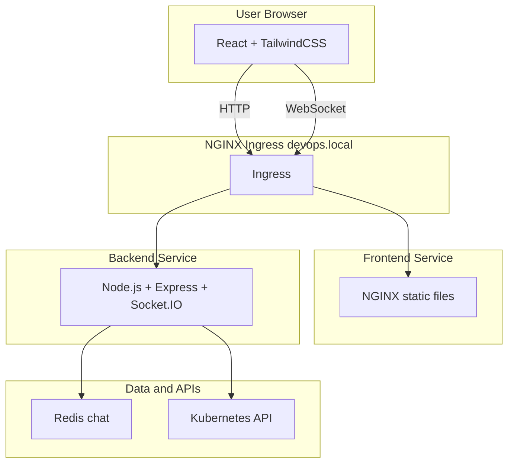
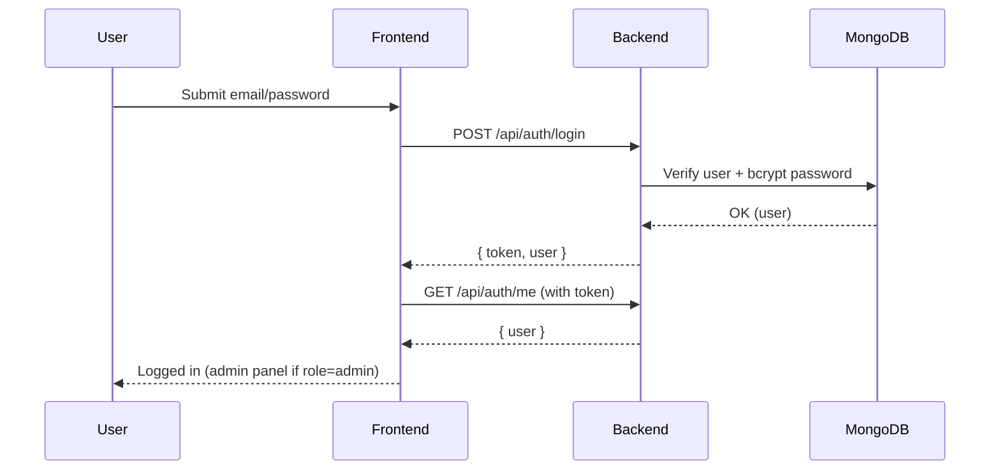
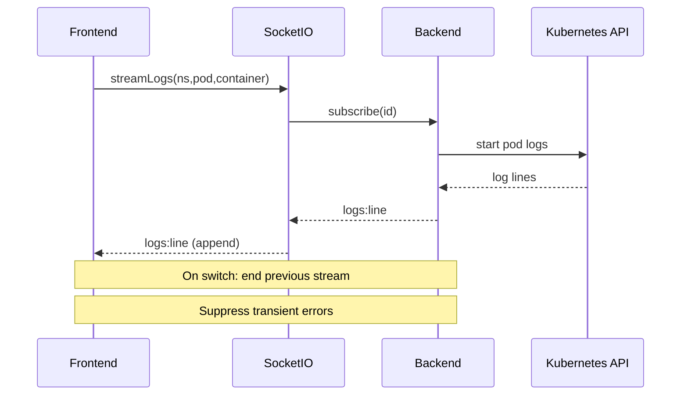
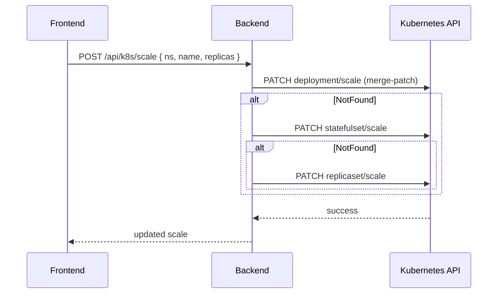

# 🚀 KubePulse - Real-Time Kubernetes Dashboard

<div align="center">


**Modern Kubernetes management dashboard with real-time monitoring, deployment scaling, log streaming, authentication with admin panel, and team chat.**

</div>

---

## 🎬 Architecture Overview



---

## ✨ What’s New

- 🔐 Authentication with Admin Panel (JWT, user list/role update/delete)
- 📜 Resilient Pod Log Streaming (smooth pod/container switches)
- ⚖️ Robust Scaling API (Deployment → StatefulSet → ReplicaSet fallbacks)
- 📈 Prometheus metrics at `/metrics`
- 🧰 DEMO_MODE support for mock K8s data
- 🧭 Cleaner API paths under `/api/k8s/*`
- 🧼 Single-command deploy with `deploy.sh` (all other scripts optional)

---

## ✨ Features

### 🎛️ Kubernetes Management
- 📊 Real-time Dashboard with auto-refresh
- 🚀 Deployment Scaling (Deployments, StatefulSets, ReplicaSets)
- 📦 Pod Management (view, restart, delete)
- 📈 Live Events
- 📜 Log Streaming with resilient switching
- 🔄 Multi-Namespace switching

### 🔐 Authentication & Admin Panel
- 🔑 JWT-based authentication
- 👥 Admin Panel: list users, change roles, delete users
- ⚖️ Role-based access on protected endpoints

### 💬 Team Chat
- 💬 Real-time messaging (Socket.IO)
- 👥 Online users presence (Redis-backed when available)
- ⌨️ Typing indicators

### 📊 Observability
- 🧪 Health: `GET /api/health`
- 📈 Metrics: `GET /metrics`

### 🧪 Demo Mode
- Set `DEMO_MODE=true` to serve mock Kubernetes data when cluster is unavailable

### 🎨 UI/UX
- 🌈 3 Themes: Light, Dark, Cyberpunk
- 📱 Responsive design with TailwindCSS

---

## 🛠️ Technology Stack

| Layer | Technologies |
|-------|-------------|
| **Frontend** | React 18, TailwindCSS, Socket.IO Client, Axios, Vite |
| **Backend** | Node.js, Express, Socket.IO, @kubernetes/client-node, Mongoose, prom-client |
| **Infrastructure** | Kubernetes, Docker, Redis, NGINX Ingress |
| **Deployment** | Kind, Kubernetes YAML, One-command `deploy.sh` |

---

## 📋 Prerequisites

- 🐳 Docker (20.10+)
- ☸️ kubectl (1.24+)
- 🎯 Kind (0.20+) — optional; script creates if missing
- 💻 Node.js (20+) — only for local development

---

## 🚀 Deployment Flow

```mermaid
graph LR
    A[Start: ./deploy.sh] --> B[Check prerequisites]
    B --> C[Create Kind cluster]
    C --> D[Build Docker images]
    D --> E[Load images into Kind]
    E --> F[Install Ingress NGINX]
    F --> G[Apply Kubernetes manifests]
    G --> H[Wait for rollout]
    H --> I[Open http://devops.local]
```



Notes
- Only `deploy.sh` is required. All other helper scripts are optional.
- The script also generates `start-dev.sh` and `stop-dev.sh` for local hot-reload.

---

## 🚀 Quick Start

```bash
# Clone the repository
git clone https://github.com/Sandarsh18/KubePulse-Real-Time-Kubernetes-Management-Dashboard.git
cd cl-mg

# Deploy everything with one command
./deploy.sh
```

Access
- 🌐 http://devops.local

---

## ⚙️ Configuration

### Backend (`backend/.env`)
```bash
# Server
PORT=8080
NODE_ENV=production
FRONTEND_URL=http://devops.local

# Database
MONGO_URI=mongodb://mongodb.devops-demo.svc.cluster.local:27017/kubepulse

# Auth
JWT_SECRET=<generated>
JWT_EXPIRES_IN=7d

# Optional
DEMO_MODE=false
REDIS_URL=redis://redis:6379
```

### Frontend (`frontend/.env`)
```bash
# Base URL without /api (frontend adds /api in requests)
VITE_API_URL=http://devops.local
```

---

## 📡 API Endpoints (current)

Kubernetes
```bash
GET  /api/k8s/namespaces                 # List namespaces
GET  /api/k8s/pods?ns=<namespace>        # List pods
GET  /api/k8s/deployments?ns=<namespace> # List deployments
GET  /api/k8s/events?ns=<namespace>      # List events
GET  /api/k8s/logs?ns=<ns>&pod=<pod>&container=<c>  # Recent logs snapshot
POST /api/k8s/scale                      # Scale workload
     Body: { ns, name, replicas }        # Supports Deployment/StatefulSet/ReplicaSet
```

Authentication
```bash
POST   /api/auth/signup
POST   /api/auth/login
POST   /api/auth/logout
GET    /api/auth/me
GET    /api/auth/users            # Admin only
PATCH  /api/auth/users/:id/role   # Admin only
DELETE /api/auth/users/:id        # Admin only
```

WebSocket (Logs)
```javascript
// Client → Server
socket.emit('streamLogs', { ns, pod, container })

// Server → Client
socket.on('logs:line', (line) => { /* new log line */ })
socket.on('logs:error', (err) => { /* error info */ })
```

---

## 🎨 Usage Tips

- 🧭 Logs: Switching pod/container is resilient; transient HTTP errors are suppressed during stream changes.
- ⚖️ Scaling: Merge-patch with fallbacks; works for Deployments, StatefulSets, and ReplicaSets.
- 🔄 Namespaces: Changing namespace resets pod selection to avoid stale streams.

---


## 🧭 Detailed Flows

### 🔐 Authentication Flow (JWT)


### 📜 Pod Logs Streaming (Resilient Switching)


### ⚖️ Scaling (with Fallbacks)


---

## 🧑‍💻 Local Development (Hot Reload) 

> Generated automatically by deploy.sh as start-dev.sh and stop-dev.sh

- Backend: http://localhost:5000
- Frontend: http://localhost:3000
- MongoDB: mongodb://localhost:27017

Commands
```bash
./start-dev.sh   # starts backend+frontend with hot reload
./stop-dev.sh    # stops dev servers
```

Tips
- Frontend API base: set `frontend/.env.local` → `VITE_API_URL=http://localhost:5000`
- Backend CORS: set `backend/.env.local` → `FRONTEND_URL=http://localhost:3000`

---

## 🏭 Production Deployment Notes

- Images: Push to your registry and update `image:` in `k8s/*-deployment.yaml`
- Domain: Change `k8s/ingress.yaml` host and `FRONTEND_URL` in backend env
- TLS: Terminate TLS at ingress (nginx); add certificate via cert-manager or secrets
- MongoDB: Replace `emptyDir` with a `PersistentVolumeClaim` or use managed MongoDB
- Redis: Use a managed Redis for durability

---

## 🌐 Ingress & WebSocket Notes

- Ingress host: `devops.local` → add to `/etc/hosts` → `127.0.0.1 devops.local`
- Paths: `/` → frontend, `/api` → backend REST, `/socket.io` → backend Socket.IO
- Annotations (nginx):
  - `nginx.ingress.kubernetes.io/websocket-services: "backend"`
  - `nginx.ingress.kubernetes.io/proxy-read-timeout: "3600"`
  - `nginx.ingress.kubernetes.io/proxy-send-timeout: "3600"`
- Socket.IO probe: HTTP 400 on polling handshake is acceptable; upgrade follows

---

## 🛠️ Troubleshooting (Expanded)

- 🚫 Double /api in requests
  - Ensure `VITE_API_URL` does NOT include `/api` (frontend adds it)
- 🔐 401 after login
  - Make sure the token is present; log out/in and hard refresh (Ctrl+Shift+R)
- 🌐 404 via ingress
  - Verify `/etc/hosts` and ingress host match; `kubectl -n devops-demo get ingress`
- 🔌 WebSocket disconnected
  - Ingress annotations present; backend service exposed; backend healthy at `/api/health`
- 🗄️ MongoDB connection fails
  - `MONGO_URI` must point to `mongodb.devops-demo.svc.cluster.local:27017/kubepulse`
- 🎛️ Scaling returns 404
  - Check object kind/name/namespace; RBAC applied (`k8s/rbac.yaml`)

---

## ⚙️ Performance & Scaling Best Practices

- Set CPU/Memory requests/limits (backend already has sane defaults)
- Enable HPA on backend based on CPU or custom metrics via `/metrics`
- Use liveness/readiness probes (already configured on backend)
- Prefer merge-patch on `scale` subresource (implemented)

---

## 🔒 Security Notes

- Do not commit real secrets; set `JWT_SECRET` via env/secret
- CORS origin must match your frontend URL
- Use TLS in production (ingress) and secure cookies if applicable
- Least-privilege RBAC; no cluster-admin required

---

## 🗺️ Roadmap

- 📦 Persistent volumes for MongoDB by default
- 📉 HPA examples and Grafana dashboards
- 🔁 Rollout controls (restart, rollout status UI)
- 🔔 Notifications for Events
- 🛡️ SSO providers (OAuth)

---

## 🔗 Helpful Links

- Kubernetes Ingress NGINX: https://kubernetes.github.io/ingress-nginx/
- Kind: https://kind.sigs.k8s.io/
- Socket.IO: https://socket.io/
- Prometheus Node client: https://github.com/siimon/prom-client

---

<div align="center">

🧩 Stickers: ☸️ 🐳 🚀 🔧 🔌 📈 🔐 🧪 🧰 🎨 ⚙️

</div>
